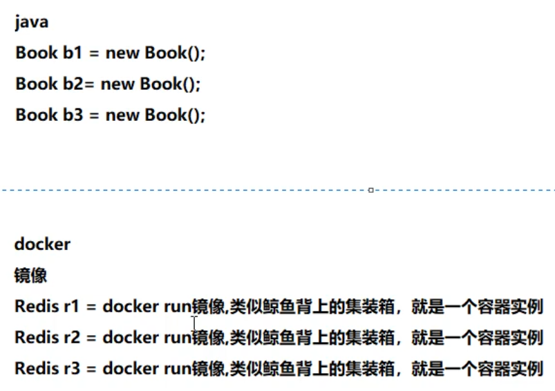

# Docker概念

## 一、要求

操作系统必须为64位，centos内核必须为3.8或以上

查看内核信息：

```shell
uname -r 
```

查看操作系统：

```shell
cat /etc/redhat-release
```

## 二、三要素

镜像（image）:类似于java中类模板，使用一个类可以new出来很多对象。

容器（Container）：类似于java中的对象。镜像是静态的定义，容器是镜像运行时的实体。容器由两部分组成：一部分是最小最核心赖以生存的Linux内核文件，不需要的东西不加载；另一部分就是不同镜像的不同东西（mysql、redis等）。



仓库（repository）：类似maven仓库，集中存放镜像文件的场所。分为公开仓库和私有仓库。

