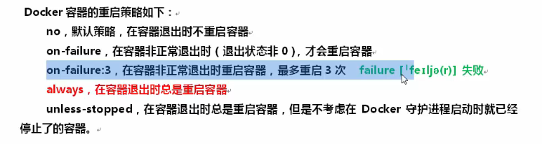
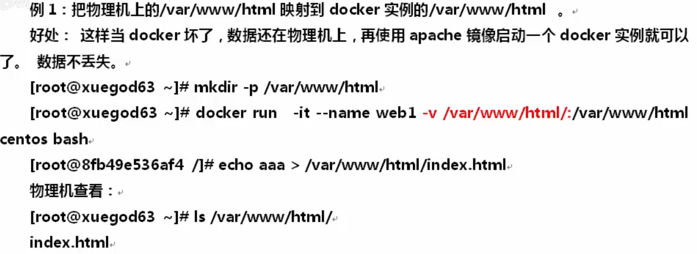
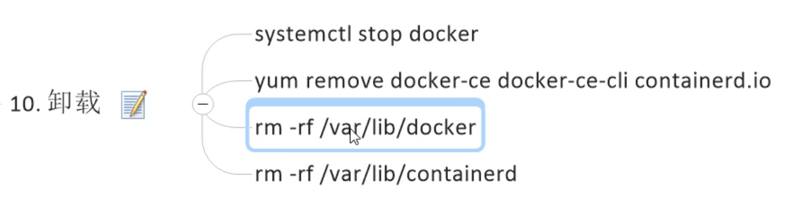
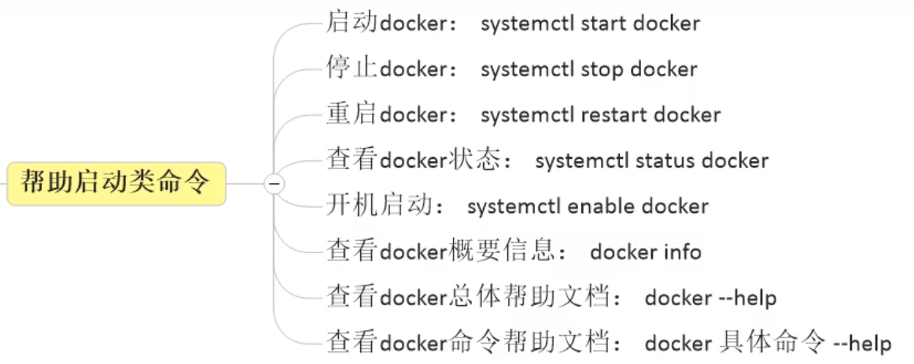
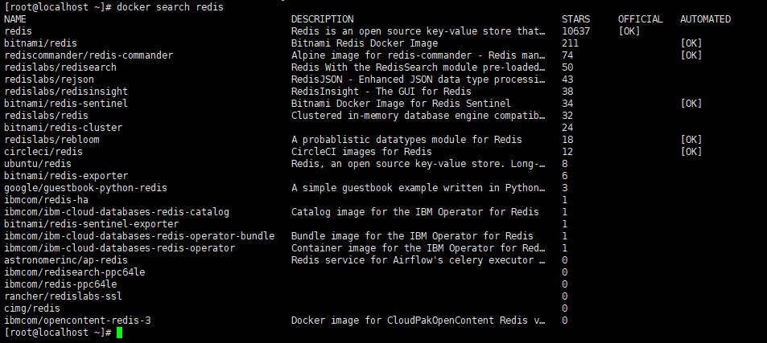
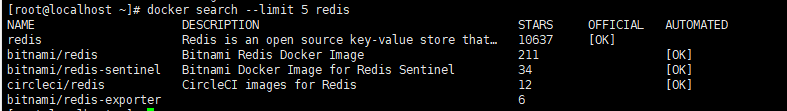
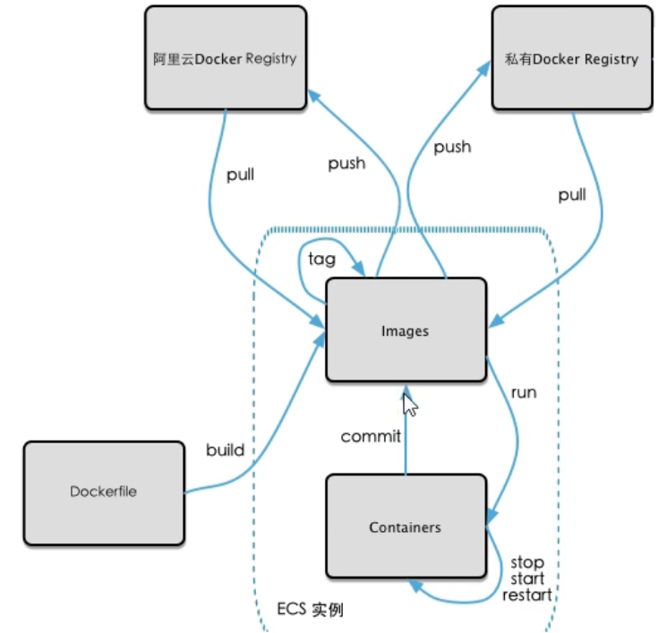

### 一、基础命令

2.docker version  查看docker版本

### 二、容器资源配额

1.-c 权重值 或者 --cpu-shares 权重值

取值在1~1024

2.docker run -it -m 128m centos 

限制这个容器只能是用128m的内层

### 三、数据映射 

### 四、卸载

### 五、帮助启动类命令

### 六、镜像命令

1. docker images  列出本地主机上的镜像
2. docker search hello-world  查询仓库中是否有相关镜像

上图是查询远程库是否有redis镜像，能查到一大堆，一般找最上面的，官方认证的。如果嫌搜索结果多可以使用--limit来分页

3.docker pull mysql:5.5 从仓库拉取目标镜像（版本号）

4.docker system df 查看镜像/容器/数据卷所占的空间

5.删除：

- docker rmi  镜像名/镜像id     删除
- docker rmi -f 镜像名/镜像id          强制删除

### 七、容器命令

#### 1.新建+启动容器

docker run -it 镜像名 bash

- -it 以交互模式启动容器，并打开一个伪终端

- --name=test1  将容器命名为test1

#### 2.列出当前所有正在运行的容器

docker ps [OPTIONS]

- -a 列出当前所有正在运行的容器+历史上运行过的
- -l 显示最近创建的容器
- -n [数字] 显示最近n个创建的容器
- -q 只显示容器id

#### 3.退出容器

两种方式：

1. exit          run进去容器，exit退出，容器停止
2. ctrl+p+q          run进去容器，ctrl+p+q退出，容器不停止

#### 4.启动已停止的容器

docker start 容器id或容器名

#### 5.重启容器

docker restart 容器id或容器名

#### 6.停止容器

docker stop 容器id或容器名

#### 7.强制停止容器

docker kill 容器id或容器名

#### 8.删除已停止的容器

docker rm 容器id或容器名

-f 强制删除

#### 9.查看日志

docker log 容器id或容器名

#### 10.重新进入容器

##### 方法一：

docker exec [OPTIONS] CONTAINER COMMAND [ARG...]

翻译过来就是：docker exec -it 容器id 命令

##### 方法二：

docker attach CONTAINER 

##### 区别：

attach直接进入容器启动命令的终端，不会启动新的进程。用exit退出，会导致容器的停止。

exec是在容器中打开新的终端，并且可以启动新的进程。用exit退出，不会导致容器的停止。

#### 11.从容器内拷贝文件到主机

docker cp 容器id:容器内路径 目的主机路径

#### 12.导入和导出容器

导出：docker export 容器ID > 文件名.tar

导出容器的内容流作为一个tar归档文件

导入： cat 文件名.tar|docker import - 镜像用户/镜像名:镜像版本号

从tar包中的内容创建一个新的文件系统再导入为镜像

#### 13.提交容器副本成为新镜像

docker commit -m="提交的描述信息" -a="作者" 容器ID 要创建的目标镜像名:[标签名（版本）]

示例：

运行一个ubuntu容器，使用vim 命令，提示vim command not found。

这时候运行：

apt-get update

apt-get -y install vim

运行完就支持vim命令了。

然后使用docker commit就可以将这个容器打包成现成镜像（含有刚装的vim命令）。

### 八、镜像操作流程

