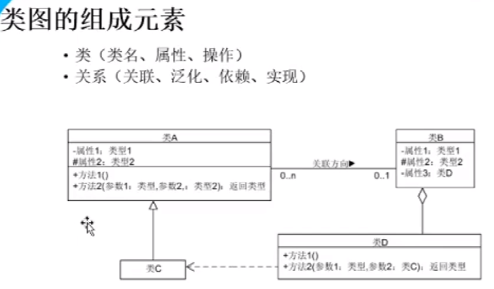
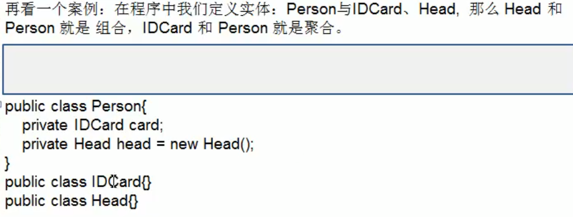

## 1.类图得组成元素

### 1.1属性：

-属性1：说明这个属性是私有的（private）

#属性：说明这个属性是保护类型的（protect）子类，同包可见

+方法（）:共有类型

~属性：包内可见

-/属性：说明此属性是由类中其它属性派生而来

<u>-属性：</u>静态属性

### 1.2关系

虚线箭头：依赖，类A的成员属性，方法参数，方法中，或者返回参数需要类B的实例对象，由A指向B，就是A依赖B，依赖关系很宽泛

关联关系：

其实是依赖关系的特例，能表达双向或单向，还有多重性。

单项用实线箭头表示，双向直接用实线表示。

聚合关系：

是关联关系的特例，还是具有导航性和多重性,A中有属性是B对象，但是没有new，就是聚合，整体和部分可以分开。

组合关系：

A中直接new了B，就升级为组合关系。实线菱形箭头。

整体和部分不可以分开。

泛化关系：

空箭头：继承，子指向父

虚线空箭头：实现关系。

