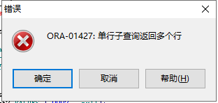

# 方法一：

用于大数据量的更新，效率比较高，括号内的select语句为虚拟表，要求where字段必须是主键或唯一索引（b.customer_id和a.customer_id）。记录一下，以后用得上。

例子：

```sql
update (select a.city_name, b.city_name as new_name
          from customers a, tmp_cust_city b
         where b.customer_id = a.customer_id)
   set city_name = new_name;
--只能用于oracle
```


先来一段sql示例，直接就能用

```sql
--创建一个表，三个字段
DROP TABLE  wlzsh;
CREATE TABLE wlzsh(
  realid integer NOT NULL,
  codeid varchar2(50) NOT NULL,
  cgzz varchar2(10) DEFAULT NULL,
  PRIMARY KEY (realid)
)
--创建一个表，两个字段（和上面一致）
DROP TABLE  wlzsh2;
CREATE TABLE wlzsh2( 
  codeid varchar2(50) NOT NULL,
  cgzz varchar2(10) DEFAULT NULL,
  PRIMARY KEY (codeid)
)

INSERT INTO wlzsh VALUES ('1', '0001', '张三');
INSERT INTO wlzsh VALUES ('2', '0005', '李四');
INSERT INTO wlzsh VALUES ('3', '0003', '李五');
INSERT INTO wlzsh VALUES ('4', '0004', '李6');
INSERT INTO wlzsh VALUES ('5', '0002', '李7');
INSERT INTO wlzsh VALUES ('6', '0006', '李8');
INSERT INTO wlzsh VALUES ('7', '0006', '李9');
delete from wlzsh where realid='7'


INSERT INTO wlzsh2 VALUES ('0001', null);
INSERT INTO wlzsh2 VALUES ('0002', null);
INSERT INTO wlzsh2 VALUES ('0003', null);
INSERT INTO wlzsh2 VALUES ('0004', null);
INSERT INTO wlzsh2 VALUES ('0005', null);
INSERT INTO wlzsh2 VALUES ('0006', null);

--给codeid加唯一性约束（不加就有坑）
alter table wlzsh add unique (codeid)


--不加就执行不了这个
update (select b.cgzz  ,a.cgzz as new_name
          from wlzsh a , wlzsh2 b
         where b.codeid = a.codeid)
   set cgzz = new_name;


select * from wlzsh2;

select * from wlzsh;

```

其中碰到一个严重问题：

一开始我并没有给wlzsh表的codeid加唯一性约束，结果下面这段就报错：ORA-01779: 无法修改与非键值保存表对应的列

```sql
update (select b.cgzz  ,a.cgzz as new_name
          from wlzsh a , wlzsh2 b
         where b.codeid = a.codeid)
   set cgzz = new_name;
```

但是换一下就不报错:

```sql
update (select a.cgzz  ,b.cgzz as new_name
          from wlzsh a , wlzsh2 b
         where b.codeid = a.codeid)
   set cgzz = new_name;
```

后来看了这个博客解决了：

# “ORA-01779: 无法修改与非键值保存表对应的列”中涉及的概念和解决方法

什么是键值保存表（Key-Preserved Table）？

在理解什么是键值保存表之前，首先要知道 ***可更新的联接视图\*** 这个概念，键值保存表只是保存了允许更新的字段信息的一张表。为什么会出现这么一张表呢？一步一步来看吧。

## 理解“视图”、“联接视图”、“可更新的联接视图”的概念

**视图**可以分为视图对象和内嵌视图两种。

**- 视图对象（View Object）**
数据库里的**视图对象**跟一张表或索引等一样，是数据库对象中的一种，它其实是将基于表中原始数据的查询给虚拟了一层之后，提供给外部查询的一种对象。
其本质是并不保存查询的实际结果，而只是将查询语句保存在数据库中，当用户查询某张视图的时候，就会找到并执行这个视图的语句。
而**联接视图**其实就是在一个视图中将两个表建立关联就是了。


```sql
-- 基于SCOTT用户下的表创建测试表
CREATE TABLE EMP_T AS
     SELECT *
     FROM EMP;

CREATE TABLE DEPT_T AS
     SELECT *
     FROM DEPT;

-- 创建视图对象（联接视图）
CREATE OR REPLACE VIEW EMP_DEPT_V
     AS
          SELECT E.EMPNO
               , E.ENAME
               , E.SAL
               , E.DEPTNO
               , D.DNAME
          FROM EMP_T E, DEPT_T D
          WHERE E.DEPTNO = D.DEPTNO;
 
```

**- 内嵌视图（Inline View）**
在SQL语句中，很多地方都可以写嵌套的语句，比如说，FROM后面可以套括号嵌套其他的语句，WHERE、SELECT、UPDATE、INSERT、DELETE后面都是可以写的。只是写的位置不同，执行的方式还有处理时的一些限制不同，这些SQL中嵌套的SQL被称为**子查询（Subquery）** 。子查询可以分为如下几类：

- 内嵌视图：位置位于FROM语句中，也相当于一个预处理结果集的概念
- 标量子查询（Scalar Subquery）：只返还一个结果值的子查询。位于SELECT语句的子查询只能返还一个值，所以必然是标量子查询，WHERE语句里也会出现这样的子查询
- 关联子查询：将查询的结果传递给子查询作为参数的使用的形式
- 一般子查询：除了那些特殊形式的子查询以外的一般用法


```sql
-- 内嵌视图的示例
-- 联接内嵌视图
SELECT *
FROM
     (SELECT E.EMPNO
           , E.ENAME
           , E.SAL
           , E.DEPTNO
           , D.DNAME
      FROM EMP_T E, DEPT_T D
      WHERE E.DEPTNO = D.DEPTNO
     );
```

**那什么是可更新联接视图（Updatable Join View ）?**

很简单，就是将一个联接视图（包括视图对象和内嵌视图）放到UPADTE语句中这样的语法形式。

> 暂时不考虑SQL语句的意义，只是测试用


```sql
-- 基于视图对象的
UPDATE EMP_DEPT_V
SET ENAME = ENAME || '-' || DEPTNO;

-- 基于内嵌视图的
UPDATE
     (SELECT E.EMPNO
           , E.ENAME
           , E.SAL
           , E.DEPTNO
           , D.DNAME
      FROM EMP_T E, DEPT_T D
      WHERE E.DEPTNO = D.DEPTNO
     )
SET ENAME = ENAME || '-' || DEPTNO;
```

跟到一步一步下来，到这一步的时候，别执行这个语句，先来猜猜这两条语句执行的结果是什么？

## 理解报错的原理

按照正常的联接逻辑，DEPT_T和EMP_T之间的关系是一对多关系，也就是说一个部门可以对应多个员工，而一个员工一次只能从属于一个部门。


```sql
-- 假如EMP_T中有如下数据
EMPNO | ENAME | DEPTNO
7839  , KING   , 10
7935  , MILLER , 10

-- 假如DEPT_T中有如下数据
DEPTNO | DNAME
10     , ACCOUNTING
```

这个时候如果两表联接后，用DNAME替换EMP_T中DEPTNO的话，很明显DEPTNO里的值都会替换成ACCOUNTING


```sql
EMPNO | ENAME | DEPTNO | DNAME
7839  , KING   , 10    , ACCOUNTING
7935  , MILLER , 10    , ACCOUNTING
```

但是，如果DEPT_中有两条DEPTNO为10的数据呢？


```sql
-- 假如DEPT_T中有如下数据
DEPTNO | DNAME
10     , ACCOUNTING
10     , MARCKEING
```

联接的结果就会变成：


```ruby
EMPNO | ENAME | DEPTNO | DNAME
7839  , KING   , 10    , ACCOUNTING
7839  , KING   , 10    , MARCKEING
7935  , MILLER , 10    , ACCOUNTING
7935  , MILLER , 10    , MARCKEING
```

那10号部门里的值到底应该替换成哪个？所以，这样的时候数据库也不知道该怎么处理，只能报出一个`ORA-01779: 无法修改与非键值保存表对应的列`的错误。

那怎么才能看到这个键值保存表呢？ORACLE提供了一个视图。


```ruby
SELECT *
FROM DBA_UPDATABLE_COLUMNS
WHERE OWNER = 'SCOTT' AND TABLE_NAME = 'EMP_DEPT_V';

OWNER | TABLE_NAME | COLUMN_NAME | UPDATABLE | INSERTABLE | DELETABLE
SCOTT   EMP_DEPT_V     EMPNO            NO          NO          NO
SCOTT   EMP_DEPT_V     ENAME            NO          NO          NO
SCOTT   EMP_DEPT_V     SAL              NO          NO          NO
SCOTT   EMP_DEPT_V     DEPTNO           NO          NO          NO
SCOTT   EMP_DEPT_V     DNAME            NO          NO          NO
```

从这里面可以看到视图`EMP_DEPT_V`里的字段都无法变更。

那怎么才能让它们可以变更呢？根据前面说的，如果能保证DEPT_T表里的数据是唯一的就能够更新。也就是说在DEPT_T表上加`主键约束`或`唯一约束`。
因为如果不加约束的话，数据库无法判断是否唯一，加上约束其实也就是向数据库告知一下，“放心改吧，不会出错！”


```cpp
ALTER TABLE DEPT_T
     ADD CONSTRAINT PK_DEPT_T PRIMARY KEY (DEPTNO);
```

再看一下之前的表（如果结果跟下面不一样，重建一下视图）：


```ruby
SELECT *
FROM DBA_UPDATABLE_COLUMNS
WHERE OWNER = 'SCOTT' AND TABLE_NAME = 'EMP_DEPT_V';

OWNER | TABLE_NAME | COLUMN_NAME | UPDATABLE | INSERTABLE | DELETABLE
SCOTT   EMP_DEPT_V     EMPNO            YES         YES         YES
SCOTT   EMP_DEPT_V     ENAME            YES         YES         YES
SCOTT   EMP_DEPT_V     SAL              YES         YES         YES
SCOTT   EMP_DEPT_V     DEPTNO           YES         YES         YES
SCOTT   EMP_DEPT_V     DNAME             NO          NO          NO
```

这个时候就可以看到，视图中EMP_T表中原来的字段都是可以更新的了。

可以执行一下前面的语句，测试一下。

> 总结一下：
> 在对联接视图进行变更的时候，必须保证修改后的值是唯一的，并且这个事实要让数据库知道，而告知数据库的方法是建立主键约束或唯一约束。

**那么问题来了，有什么方法能够不添加约束也能变更？并不是所有的表都可以随意建这些约束啊。**

> **解决的方法：**
>
> - 添加`/*+ BYPASS_UJVC */` 提示，让ORACLE跳过检查（11g R2之后无效，不建议使用）
> - 改写`UPDATE`语句，通过其他方式判断后处理
> - 将`UPDATE`改成`MERGE`语句

## 参考ORACLE官方文档的解释：

> The concept of a **key-preserved table** is fundamental to understanding the restrictions on **modifying join views**. A table is key-preserved if every key of the table can also be a key of the result of the join. So, a key-preserved table has its keys preserved through a join.

> An **updatable join view** (also referred to as a **modifiable join view**) is a view that contains multiple tables in the top-level FROM clause of the SELECT statement, and is not restricted by the WITH READ ONLY clause.

### [附上原文连接](https://www.jianshu.com/p/60a56760b19f)

# 方法二：

这是苗伟给的sql，也可以实现对应的插入

```sql
update wlzsh2 t
   set t.cgzz =
       (select t2.cgzz from wlzsh t2 where t2.codeid = t.codeid)
 where t.codeid in (select t3.codeid from wlzsh t3);
```

### 错误理解：

​		一开始理解错误，以为子查询select t2.cgzz from wlzsh t2 where t2.codeid = t.codeid是为了将两个表共有的值（内连接）查出来，取出其wlzsh表的cgzz字段（有值）生成结果集，然后再用第二个结果集框定一个数据范围（where t.codeid in (select t3.codeid from wlzsh t3);   codeid=wlzsh表中存在的codeid），这样，将第一个子查询中的结果集中的数据一条一条的插入框定出来的数据（第二个子查询框定的范围）的cgzz属性。

```sql
update wlzsh2 t
   set t.cgzz =
       (select t2.cgzz from wlzsh t2 where t2.codeid = t.codeid)
 where t.codeid in (select t3.codeid from wlzsh t3);
```

​		按这个理解，是没法解释顺序问题的，因为你一条一条用结果集二中框定出范围的数据去对应结果集一的数据，怎么保证对应关系（t2.codeid = t.codeid）？

而且，如果按照这个逻辑将子查询修改一下应该也是可以实现的，并且还便于调试：

```sql
update wlzsh2 t
   set t.cgzz =
       (select t2.cgzz from wlzsh t2,wlzsh2 t4 where t4.codeid = t4.codeid)
 where t.codeid in (select t3.codeid from wlzsh t3);
```

第一个子查询能查出所有的两者都有的所有数据的结果集，然后一个个赋值给wlzsh的数据。

但是这条语句报错，报错是：



说明啥，说明这个set语句所支持的子查询只能是单行结果的，但是你这sql返回了多行数据。

所以说错误的理解是不行的。

### 正确理解：

​		从外向内的去理解：

```sql
update wlzsh2 t
   set t.cgzz =
       ${一个值}
 where t.codeid in ${一堆值};
```

首先要明白，update多条数据的时候，应该是一条一条去执行的，

cisn先看update 哪个表？wlzsh2。

再看范围（where）:   t.codeid= 一堆值，

哪堆值：select t3.codeid from wlzsh t3的结果集

一堆值可以理解为一个一个的值，走到这一步，就已经拿到了t.codeid符合条件的这些值的其中一个（如果是t.codeid=一个确切的值更好理解，那这时候已经拿到这条数据了）

最后set：

给这条数据的cgzz字段赋值：赋什么值呢？子查询

------

子查询分析：

```sql
select t2.cgzz 
from wlzsh t2 
where t2.codeid = t.codeid
```

先看from：wlzsh t2 

再看where：t2.codeid = t.codeid

哪条数据呢？wlzsh表的codeid字段等于t.codeid的数据

### **注意！注意！！注意！！！**

这里的t.codeid是指刚才外层的那个已经被拿到的数据的codeid

所以这个子查询查出来的值是唯一的一条数据

再看select： t2.cgzz 

将这条数据的cgzz取出来，作为结果（唯一的一条哦）返回给上层的set语句


------

然后回到外层查询的set，将这个唯一的值插入进去，完事了


