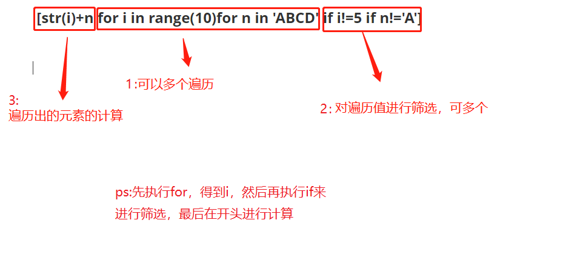
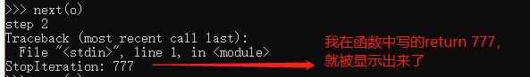
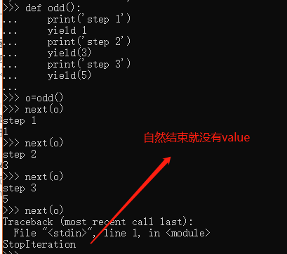
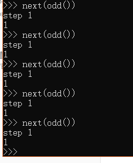

# 迭代

不光是有下标的list或者tuple可以使用for...in，无下标的dict或者字符串也可以进行迭代：

```python
>>> d = {'a': 1, 'b': 2, 'c': 3}
>>> for i in d:
...     print(i)
...
a
c
b
```

默认情况下，dict迭代的是key。如果要迭代value，可以用`for i in d.values()`，如果要同时迭代key和value，可以用`for k, v in d.items()`。

如果要对list实现类似Java那样的下标循环怎么办？Python内置的`enumerate`函数可以把一个list变成索引-元素对，这样就可以在`for`循环中同时迭代索引和元素本身：

 

```python
>>> for i, value in enumerate(['A', 'B', 'C']):
...     print(i, value)
...
0 A
1 B
2 C
```

 

上面的`for`循环里，同时引用了两个变量，在Python里是很常见的，比如下面的代码：

 

```python
>>> for x, y in [(1, 1), (2, 4), (3, 9)]:
...     print(x, y)
...
1 1
2 4
3 9
```

# 列表生成式

这玩意太可怕了

###  [str(i)+n for i in range(10)for n in 'ABCD' if i!=5 if n!='A']



可以用多个for，也可以一个for同时遍历两个值，也可以组合使用，如下：

####  [str(i)+n+str(j) for i in range(10)for j,n in enumerate(['A', 'B', 'C']) if i!=5 if n!='A']

执行顺序：

​     先执行for语句，再执行if语句来筛选，将true的筛选出来，再到最开头的计算公式里进行计算得到结果，如下：

##  L1 = ['Hello', 'World', 18, 'Apple', None]

##  [x.lower() for x in L1 if isinstance(x,str)]

这段代码就可以说明问题，它可以得出正确结果：['hello', 'world', 'apple']，说明它是先筛选str类型，再转的小写，负责会因为18无法转小写而报错


# 生成器：generator

### 一边遍历一边生成list中的后续元素，可节约存储空间

创建：将列表生成式的[]修改成()即可

```python
>>> g = (x * x for x in range(10))
>>> for n in g:
...     print(n)
... 
0
1
4
9
16
25
36
49
64
81
```

创建方法二：

创建函数型generator，把函数的return 换成yield 即可。

函数是顺序执行，遇到`return`语句或者最后一行函数语句就返回（到函数完都没遇到return就返回一个None）。

当你调用生成器函数（generator function）的时候，并不像其它函数那样直接执行并把return的结果返给你，而是只给你返回个generator对象，这时候此函数内部的代码是不执行的。只有当你把这个generator对象放进next()中，它才开始执行，并执行到第一个yield，把yield 后面的值给你返回回来。当你下一次把这个generator对象放进next()时，它才开始从上次返回的`yield`语句处继续执行，如果后面没有yield了它还是会将执行到完，然后抛出一个StopIteration的报错。

ps:只要在执行过程中碰到了return，就会结束并抛出StopIteration报错，如果return 后面有值，返回值包含在`StopIteration`的`value`中。会到结尾抛错的原因是python在函数没有写return的情况下，默认会在结尾处return None，正好触发了报错，且value为空。






再ps:一直用next多累呀，也可以用for...in，但for...in的实质还是不停的调用next()，好处就是结尾不会抛出StopIteration的报错。

坑：

举个简单的例子，定义一个generator，依次返回数字1，3，5：

```python
def odd():
    print('step 1')
    yield 1
    print('step 2')
    yield(3)
    print('step 3')
    yield(5)
```

调用该generator时，首先要生成一个generator对象，然后用`next()`函数不断获得下一个返回值：

```python
>>> o = odd()#这一句我不懂，为啥要把odd()赋给o呢，直接来next(odd())岂不是更爽???
>>> next(o)
step 1
1
>>> next(o)
step 2
3
>>> next(o)
step 3
5
>>> next(o)
Traceback (most recent call last):
  File "<stdin>", line 1, in <module>
StopIteration
```

首先：脑子短路看不懂o = odd()啥意思，这里写一下，以免下次再短路：

假入有个函数叫function（）：

1：f=function

2:   f=function()

这两个意思完全不一样：

1：第一个的意思是，原本是function这个变量指向那个你定义的函数，现在把f指向你定义的函数，所以后面无论是function()或者f()都可以调用你这个函数

2：第二个就是常用的函数调用，函数会运行，运行完了return你一个返回值，你把这个返回值赋给f

其次：我们来讨论上面注释中的问题：为啥要把odd()赋给o呢，直接来next(odd())岂不是更爽???

试了一下，是个这结果：



每次都重新执行了obb（），并没有从yield的地方继续执行

分析：根据上面对生成器函数（generator function）的描述，每一次调用并不是执行代码，而是都会返回一个generator对象，所以每次next()中的odd()都会返回一个不同的generator对象，就造成了这个结果。


# 迭代器（Iterator）和可迭代对象（Iterable）

凡是可作用于`for`循环的对象都是`Iterable`类型；

凡是可作用于`next()`函数的对象都是`Iterator`类型（generator`，包括生成器和带`yield`的generator function），它们表示一个惰性计算的序列，只有在需要返回下一个数据时它才会计算，省地方啊！！

集合数据类型如`list`、`dict`、`str`等是`Iterable`但不是`Iterator`，不过可以通过`iter()`函数获得一个`Iterator`对象。