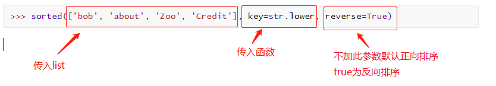

# 高阶函数

变量可以指向函数，函数名也是变量

以Python内置的求绝对值的函数`abs()`为例，调用该函数用以下代码：

```python
>>> abs(-10)
10
>>> abs
<built-in function abs>
```

#### 函数名加括号就是调用这个函数的意思，而这个函数名本身也是一个变量，它指向一个可以计算绝对值的函数！

所以，换个名字也完全ok的：

```python
>>> f = abs
>>> f(-10)
10
>>> f
<built-in function abs>
```

成功！


如果把`abs`指向其他对象，会有什么情况发生？

```
>>> abs = 10
>>> abs(-10)
Traceback (most recent call last):
  File "<stdin>", line 1, in <module>
TypeError: 'int' object is not callable
```

把`abs`指向`10`后，就无法通过`abs(-10)`调用该函数了！因为`abs`这个变量已经不指向求绝对值函数而是指向一个整数`10`！

当然实际代码绝对不能这么写，这里是为了说明函数名也是变量。要恢复`abs`函数，请重启Python交互环境。

注：由于`abs`函数实际上是定义在`import builtins`模块中的，所以要让修改`abs`变量的指向在其它模块也生效，要用`import builtins; builtins.abs = 10`。


### 综上，函数就可以作为参数，传到另一个函数中，也可以作为参数return出来，这种函数就称之为高阶函数。

一个最简单的高阶函数：

```python
def add(x, y, f):
    return f(x) + f(y)
```

当我们调用`add(-5, 6, abs)`时，参数`x`，`y`和`f`分别接收`-5`，`6`和`abs`，根据函数定义，我们可以推导计算过程为：

```python
x = -5
y = 6
f = abs
f(x) + f(y) ==> abs(-5) + abs(6) ==> 11
return 11
```


# 常用的高阶函数

## 1.map()

接收参数：1.函数名

​				   2.Iterator(可迭代对象)

返回值：Iterator（迭代器）

例：

```python
>>> def f(x):
...     return x * x
...
>>> r = map(f, [1, 2, 3, 4, 5, 6, 7, 8, 9])
>>> list(r)
[1, 4, 9, 16, 25, 36, 49, 64, 81]
```

由于结果`r`是一个`Iterator`，`Iterator`是惰性序列，因此通过`list()`函数让它把整个序列都计算出来并返回一个list。

## 2.reduce()

`reduce`把一个函数作用在一个序列`[x1, x2, x3, ...]`上，这个函数必须接收两个参数，`reduce`把结果继续和序列的下一个元素做累积计算，其效果就是：

```python
reduce(f, [x1, x2, x3, x4]) = f(f(f(x1, x2), x3), x4)
```

写一个把string转换成int的函数就是：

```
from functools import reduce

DIGITS = {'0': 0, '1': 1, '2': 2, '3': 3, '4': 4, '5': 5, '6': 6, '7': 7, '8': 8, '9': 9}

def str2int(s):
    def fn(x, y):
        return x * 10 + y
    def char2num(s):
        return DIGITS[s]
    return reduce(fn, map(char2num, s))
```

## 3.filter()

接收参数：1.函数名

​				   2.Iterator(可迭代对象)

返回值：Iterator（迭代器）

和`map()`类似，`filter()`也接收一个函数和一个序列。和`map()`不同的是，`filter()`把传入的函数依次作用于每个元素，然后根据返回值是`True`还是`False`决定保留还是丢弃该元素。

```python
把一个序列中的空字符串删掉，可以这么写：

def not_empty(s):
    return s and s.strip()

list(filter(not_empty, ['A', '', 'B', None, 'C', '  ']))
# 结果: ['A', 'B', 'C']
```

## 4.sorted（）

排序函数：

```python
>>> sorted(['bob', 'about', 'Zoo', 'Credit'], key=str.lower, reverse=True)
```



