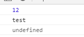

# 函数

## 1.参数默认值

ES5函数无参数默认值，ES6可以

```javascript
function log(x, y = 'World') {
  console.log(x, y);
}

log('Hello') // Hello World
log('Hello', 'China') // Hello China
log('Hello', '') // Hello
```

注意，参数变量是默认声明的，所以不能用`let`或`const`再次声明。

```javascript
function foo(x) {
    let x = 1; // error
    const x = 2; // error
  }
```

另外，函数的参数默认值是在每次调用时都重新计算的，并不是只计算一次就赋给变量。

```javascript
let x = 99;
function foo(p = x + 1) {
  console.log(p);
}

foo() // 100

x = 1000;
foo() // 1001
```

## 2.参数默认值和解构赋值默认值的结合使用

这是解构默认值：

```javascript
function foo({x, y = 5}) {
  console.log(x, y);
}

foo({}) // undefined 5
foo({x: 1}) // 1 5
foo({x: 1, y: 2}) // 1 2
foo() // TypeError: Cannot read property 'x' of undefined
```

这是参数默认值加解构默认值：

```javascript
function foo({x, y = 5} = {}) {
  console.log(x, y);
}

foo() // undefined 5
```

如果没传参，就默认给传个空对象

再看下面的例子:

```javascript
// 写法一:解构默认值+参数默认值
function m1({x = 0, y = 0} = {}) {
  return [x, y];
}

// 写法二：无解构默认值，只有一个参数默认值
function m2({x, y} = { x: 0, y: 0 }) {
  return [x, y];
}

// 函数没有参数的情况
m1() // [0, 0]
m2() // [0, 0]

// x 和 y 都有值的情况
m1({x: 3, y: 8}) // [3, 8]
m2({x: 3, y: 8}) // [3, 8]

// x 有值，y 无值的情况
m1({x: 3}) // [3, 0]
m2({x: 3}) // [3, undefined]

// x 和 y 都无值的情况
m1({}) // [0, 0];
m2({}) // [undefined, undefined]

m1({z: 3}) // [0, 0]
m2({z: 3}) // [undefined, undefined]

```

注意：通常情况下，定义了默认值的参数，应该是函数的尾参数。

## 3.rest参数

ES6 引入 rest 参数（形式为`...变量名`），用于获取函数的多余参数，这样就不需要使用`arguments`对象了。

- rest 参数搭配的变量是一个数组，该变量将多余的参数放入数组中。
- arguments不是数组！而是一个类似数组的对象。
- rest 参数之后不能再有其他参数（即只能是最后一个参数），否则会报错。

## 4.函数对象中的属性

函数本身就是一个对象，它有一些属性和方法可以使用。想要使用直接用函数名.属性名即可调用

```javascript
function person()
{
  ……
}
person.name;//es6中会输出person
person.call(Obj)//将person中的this指向Obj
person.prototype
```

**注意：**要想给函数对象中加入属性或函数，只有两种办法：

```javascript
// 方法一
person.foo = true;

// 方法二
person['a' + 'bc'] = 123;
```

试一下：

```javascript
 function person()
{
  var sex = '女';
}
person.age =12  
person['a'+'b']='test'  
console.log(person.age);
console.log(person.ab);

console.log(person.sex);
```

结果：



说明函数里声明的变量，并不能用函数对象去调用。

这时候你再试试用这个函数new一个对象：

```javascript
var p1 = new person();
console.log(p1)
```

结果：


是个空对象，只有个`__protp__`,指向person的prototype。所以说，**函数对象和new出来的对象之间的属性是不相通的。**所以，构造函数才有存在的意义。


### 4.1. length属性

指定了默认值以后，函数的`length`属性，将返回没有指定默认值的参数个数。也就是说，指定了默认值后，`length`属性将失真。

```javascript
(function (a) {}).length // 1
(function (a = 5) {}).length // 0
(function (a, b, c = 5) {}).length // 2
```


### 4.2. name属性

函数的`name`属性，返回该函数的函数名。

```javascript
function foo() {}
foo.name // "foo"
```

## 5.箭头函数

```javascript
var f = v => v;

// 等同于
var f = function (v) {
  return v;
};
```

如果箭头函数不需要参数或需要多个参数，就使用一个圆括号代表参数部分。

```javascript
var f = () => 5;
// 等同于
var f = function () { return 5 };

var sum = (num1, num2) => num1 + num2;
// 等同于
var sum = function(num1, num2) {
  return num1 + num2;
};
```

