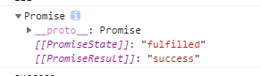
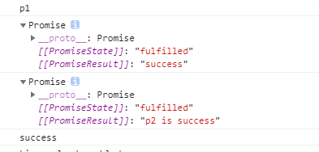

## 1.基本用法

`Promise`对象是一个构造函数，用来生成`Promise`实例。Promise新建后会立即执行

```javascript
var a =parseInt(100*Math.random());//生成一个100内随机整数，用于模拟成功|失败
//1.new一个promise实例，要传一个函数作为参数，这个函数有两个形参，这两个形参也都是传入函数。名字随便起，但是约定好是resolve和reject，系统自动往进传
const p = new Promise(function(resolve, reject){
  console.log('正在获取后台数据。。。');
  setTimeout(()=>{
    if(a%2==0){
     //2.1调用此函数，会将Promise对象的状态从执行中变成成功
    resolve('后台获取数据成功啦！！！');
        console.log(2)//ps:在resolve/reject后的代码还是会执行，且会在回调函数执行前被调用。
 }else{
     //2.2调用此函数，会将Promise对象的状态从执行中变成失败
   reject('报错！！')
 }},1000)
    
});
//3.再用这个promise实例的then绑定回调函数，then需要传两个参数，都是函数，第一个是成功的回调，第二个是失败的回调，这两个方法接收上面resolve和reject的返回值。
p.then(function(value){
  console.log(value);
},function(reason){
  console.log(reason);
})

```

`Promise`实例的状态一经确定，就再不改变了，所以如果在函数中先调用resolve后再调用reject就不执行了。反之亦然。

## 2.Promise实例

```javascript
var p1 =new Promise((resolve,reject)=>{
  console.log('p1');
  resolve('success');
  reject('错误');//不执行
})
```


通过浏览器可看到promise对象的样子



两个属性，一个是状态，一个是结果。状态就是由resolve/reject决定的，结果就是这两个函数的返回值。

## 3.Promise.prototype.then() 

then函数是在promise对象的原型对象中的方法，then方法有返回值，返回一个promise对象,这个新的promise对象的状态由回调函数的返回值去决定

```javascript
var p1 =new Promise((resolve,reject)=>{
            console.log('p1');
            resolve('success');
            reject('错误');
        })
        var p2 =p1.then(
            (value)=>{
             	console.log(value);
                return 'p2 is success'
        	},
            (err)=>{
        		console.log(err);
        	})
        console.log(p1);
        console.log(p2);
```



1.如果回调函数的返回结果是非promise类型的属性，那么这个新的promise对象的状态就是成功，Result就是返回值本身。

2.如果是promise对象，则由这个Promise对象的成功失败去决定then返回的那个promise对象的状态，这个Promise对象的resolve()/reject()的参数就是then返回的那个promise对象的Result。

3.如果是抛出错误，例如`throw '抛错';`,那么这个then返回的promise对象的状态就是失败，Result就是抛出的内容。

