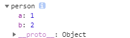
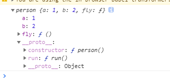

ES6中引入了Class类的概念。Class也只不过是个语法糖

## 1.基本使用

```javascript
//es5
function person(name,age){
  this.name =name ;
  this.age = age ;
  //以下这两种写法都可以给该用该函数构造出来的对象添加属性，效果一模一样，但是第一种是放在对象本身上，第二种是放在对象的原型对象上
  	//第一种
  this.fly =function(){
    console.log(this.name+' is flying……');
  }
   //第二种（写到函数外头都能行）
  person.prototype.run = function(){
    console.log(this.name+' is runing……');
  }
}
//es6
class person{
  constructor(name,age){
    this.name=name;
    this.age=age;
  }
  //下面这两个方法只能被对象调用。
    fly=function(){
    console.log(this.name+' is flying……');
    run();//调用不了
    this.run()//可以调用，因为run被放在person实例的原型对象上，供实例使用
  }
  run(){
    console.log(this.name+' is runing……');
  }
}

```

## 2.class中的this

很多数据需要初始化，所以被放在构造函数中，但还有一部分属性，有自己默认的值，不需要从外部取，那么就可以像java一样放在类中就行了，不用放在构造函数中。

```javascript
//es6
class person{
  a=1;
  b=this.a+1;
}
const p1 = new person();
console.log(p1);

```
结果：


说明啥：

1. **可以在class中直接写属性，这些属性可以供class的实例对象使用**
2. **class代码块中的this，指向class的实例对象**

这两个结论很重要！！由此可以推出两个写法

1. **用赋值的方式写函数 ，函数就被放在对象本身上**

```javascript
class person{
  a=1;
  b=this.a+1;
  //用赋值的方式写，就和a=1一样，就是把=左边换成了fly,右边换成了一个函数而已
  fly=function(){
      
  }
  //普通写法，方法在实例对象的原型对象上
  run(){
      
  }
}
const p1 = new person();
console.log(p1);
```

看看结果：



2. 既然class代码块中的this指向了实例对象，那么你在class中直接写箭头函数（箭头函数没有this，用的上级this，且在声明时就绑定），这个箭头函数中的this就将永远指向实例对象。


## 3.静态变量

众所周知，函数也是对象，根据`./3.函数.md/4.函数对象中的属性`中提及的问题，普通函数的函数对象中的属性，和用这个函数new出来的对象的属性是不通的。这时候，就称这个函数对象中的属性为静态变量（静态属性）。

想要设置这种静态变量，在es6中就要使用static关键字了。

```javascript
//es5
function person(name){
  this.name =name ;
   
}
var p1 = new person('li');
person.age=12;//用peron能调出来，用p1不行

//es6
class person{
    constructor(name){
    this.name=name;
  }
    static age =12;//用peron能调出来，用p2不行
}
var p1 = new person('zhang');
```

## 4.继承

es5中继承非常麻烦，首先子构造函数中必须调用一下父构造函数，并且用call去调用，将子构造函数中父类用到的属性值传给父类，并用父构造方法来给子构造方法中加入父类的属性；然后再把子构造函数的prototype指向父构造函数，这样就能调用父类和父类的原型对象中的方法了。

es6中就很简单：

1. extends关键字
2. 调用super（如果子类没有特有的属性就可不写constructor，当然也就不用显式调用super）

```javascript
class Person{
  constructor(name,age){
    this.name =name;
    this.age=  age;
  }
  run(){
    console.log(this.name+' is flying……');
  }
}

class Chinese extends Person{
  constructor(name,age,city){
    super(name,age);
    this.city =city;
  }
  fly(){
    console.log('this Chinese：'+this.name+' is flying……');
  }
}
const li = new Chinese('li',12,'xian')
console.log(li)
```

new出来得对象结构如下：


Chinese中的fly方法被放在Chinese的原型对象里（Person对象），而Person的run方法被放在Person他自己的原型对象中。

## 5.get和set

```javascript
class Person{

  get sex(){
    console.log('查询性别');  
    return '随便'
  }
  set sex(val){
    console.log('修改性别');
  }
}
const p1 = new Person();

console.log(p1.sex);//调用了get方法，get方法返回值就是p1.sex的值
p1.sex='男';
```

