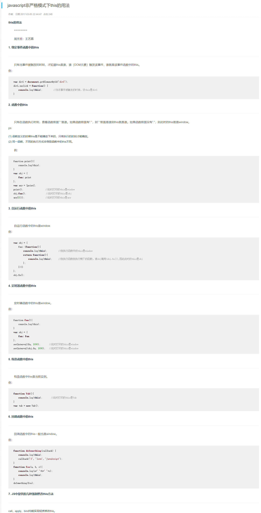
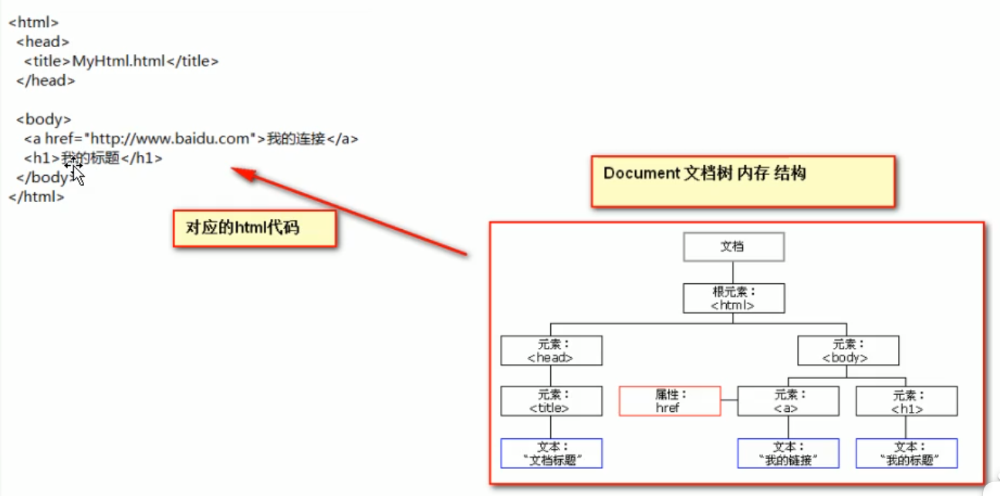

## 1.变量

#### 1.1 变量类型：

- 数值类型：number
- 字符串类型：string
- 对象类型：object
- 布尔类型：boolean
- 函数类型：function

#### 1.2J S中的特殊值：

|           |                                                  |
| --------- | ------------------------------------------------ |
| undefined | 未定义，所有js变量未赋初始值的时候，默认值都是它 |
| null      | 空值                                             |
| NAN       | 全称：Not a Number。非数值。                     |

```javascript
var i=12;
alert(typeof(i));//number

var a=12;
var b="abc";
alert(a*b);//NaN 非数字，非数值
```

#### 1.3 关系运算

等于：==                    简单的字面值比较（12==”12“，结果为true）

全等于：===			  不但字面值比较，还有两个变量的数据类型，（12===”12“，结果为false）

## 2.数组（重点！）

#### 2.1 数组的定义

var 数组名 = [];  //空数组

var 数组名 = [1,'abc',true];

和java中的声明数组还是有区别的：

```java
public static void main(String[] args){

        /**
         * 1. 固定大小的空数组, 动态创建(new的话必须固定长度，因为要在堆中开辟内存)
         */
        String[] strArr1 = new String[3];

        /**
         * 2. 创建数组并直接赋值, 动态创建
         */
        String[] strArr2 = new String[]{"data", "struct", "static"};

        /**
         * 3. 直接赋值数组, 静态创建
         */
        String[] strArr3 = {"public", "private", "protected"};
    }
```

#### 2.2 遍历和扩容

```javascript
var arr = [];  //空数组
arr[2]=true;//只要通过数组下标赋值，那么最大的下标值，就会自动给数组阔容（java直接报错）
for(var i=0;i<arr.length;i++){
    alert(arr[i]);
}
```


## 3.函数（重点！）

#### 3.1 三种函数及其调用方法

```javascript
function f1() {
    alert("无参方法");
}
function f2(a,b) {
    alert("有参方法：a="+a+";b="+b);
}
function f3(a,b) {
    return a+b;
}
f1();
f2(123,"aab");
alert(f3(100,50));
```

#### 3.2 第二种函数声明方式：

var 函数名=function(形参列表){函数体}

**ps：**js中不允许有重载，同名的函数后面就吧前面的覆盖了

#### 3.3 隐形参数

js中虽然声明了参数个数，你还是可以给他随便赋值，并可以通过arguments数组来调用它们；ES6之后，引入了rest参数的概念，就可以显式的声明一个变量来接收多余参数了，具体参见./ES6/3.函数.md

```javascript
function fun(a) {
            alert( arguments.length );//可看参数个数

            alert( arguments[0] );//1
            alert( arguments[1] );//ad
            alert( arguments[2] );//true

            alert("a = " + a);//1

            for (var i = 0; i < arguments.length; i++){
                alert( arguments[i] );
            }
        }
         fun(1,"ad",true);
```


#### 3.4 this

##### 3.4.1 this的本质

对象中的函数，其实对象和函数没啥关系，JS之父通过this将他们强行关联起来：

```js
var obj = {
        name : 'ziwei',
        sayName: function(x){
            return console.log('hello,' + x.name)
        }
    }
//从本质来说，对象和其内部函数没关系，所以想要让这个对象say自己的name，还要把这对象传进去，尴尬
obj.sayName(obj);
```

**为了能够obj.sayName(),让这个obj自己的传递进去,JS之父发明了this.（所以，this是针对函数所定义的，其它地方根本不存在this的）**

你可以理解为JS做了一件事情,就是你每次调用函数时,都偷偷给你传递了一个参数,你用this就可以拿到这个参数。

```javascript
    var obj = {
        name : 'ziwei',
        sayName: function(){
            return console.log('hello,' + this.name)
        }
    }
    obj.sayName()   
```

当你在全局定义function时，此时的调用者其实是window。所以this就是window；最怪的是，箭头函数说好用父函数的this，但window的this好像就是他自己，所以在箭头函数中调this就还是window咯

##### 3.4.2 this的用法




#### 3.5函数中的this（和箭头函数的区别）

首先明确几个概念：

1.箭头函数没有this，在它里面使用this统统是使用它外面的环境的this；同样的，以下三个变量在箭头函数之中也是不存在的，指向外层函数的对应变量：`arguments`、`super`、`new.target`：

```javascript
function foo() {
  setTimeout(() => {
    console.log('args:', arguments);
  }, 100);
}

foo(2, 4, 6, 8)
// args: [2, 4, 6, 8]
```

2.自运行函数（快速调用函数）的调用者是window对象，无论在哪个函数或哪个对象中快速调用,都是window在调用。

3.对象中的属性只能通过“对象名.属性名”去调用

4.js是以函数来划分作用域的（ES5）。


```javascript
<script type="text/javascript">
		var name='window.name'
		var a ={
			name:'AAA',
			f1:function(){
				console.log(this.name);//偷偷把调用此函数的对象传进来了，并用this去调用
			},
			f2:()=>{
				console.log(this.name);//箭头函数没有this，就用上级的this，上级this是window
			},
			f3:function(){
				(()=>{
				console.log(this.name)//箭头函数没有this，就用上级的this，上级this是f3的this
			})()//虽然调用者是window，但是用的是上级this，上级this是f3的this，也就是a
			}
			,
			f4:function(){
				
				(function(){
				console.log(this.name)//偷偷把调用此函数的对象（window）传进来了，并用this去调用
			})()//快速调用函数的调用者是window对象，无论在哪个函数或哪个对象中快速调用,都是window在调用
			}
			,
			f5:function(){
				var s= ()=>{
				console.log(this.name)//使用父环境的this，也就是f5的this，所以就算window立即调用，也不影响
			}
			s();
			}
			,
			f6:function(){
				var name = 'f6';
				console.log(name);//这里的name就是指本作用域的name，也就是f6
				console.log(this.name);//这里的this就是函数调用者把自己给f6传进来，所以谁调f6就是谁
				var s= function(){
					console.log('--------');
				console.log(this.name);//同理，这就是个普通函数，谁调他，谁就把自己当成this传给他
			}
			s();//直接调用，由window完成
			}
			,
			f7:function(){
				console.log(this.name);//谁调就是谁
				var s = function(){
					console.log(this.name);
				}
				return s;//将这个函数当成返回值赋给另一个指针，谁调那个指针this就是谁
			},
			f8:function(){
				console.log(this.name);//谁调就是谁
				var s = ()=>{
					console.log(this.name);//定义时用上级this
				}
				return s;
			},
			f9:()=>{
				console.log(this.name);//用上级this，上级的this此时是window
				(function(){
					console.log(this.name);//谁调就是谁
				})()//立即执行函数，由window调用
			}
		}
		var b = {
			name:'BBB'
		}
		console.log('++++++++++++++++');
		console.log('----------1--------');
		a.f1();
		a.f1.call(b);
		console.log('-----------2-------');
		a.f2();
		a.f2.call(b);
		console.log('-----------3-------');
		a.f3();
		a.f3.call(b);
		console.log('-----------4-------');
		a.f4();
		a.f4.call(b);
		console.log('-----------5-------');
		a.f5();
		a.f5.call(b);
		console.log('-----------6-------');
		a.f6();
		a.f6.call(b);
		console.log('-----------7-------');
		var f7 = a.f7();
		f7();
		f7.call(b);
		console.log('-----------8-------');
		var f8=a.f8();
		f8();
		f8.call(b);
		console.log('-----------9-------');
		a.f9();
		a.f9.call(b);
		console.log('++++++++++++++++');

</script>

```

结果：
```html
 ++++++++++++++++ at test.html:93
 ----------1-------- at test.html:94
 AAA at test.html:33
 BBB at test.html:33
 -----------2------- at test.html:97
 window.name at test.html:36
 window.name at test.html:36
 -----------3------- at test.html:100
 AAA at test.html:40
 BBB at test.html:40
 -----------4------- at test.html:103
 window.name at test.html:47
 window.name at test.html:47
 -----------5------- at test.html:106
 AAA at test.html:53
 BBB at test.html:53
 -----------6------- at test.html:109
 f6 at test.html:60
 AAA at test.html:61
 -------- at test.html:63
 window.name at test.html:64
 f6 at test.html:60
 BBB at test.html:61
 -------- at test.html:63
 window.name at test.html:64
 -----------7------- at test.html:112
 AAA at test.html:70
 window.name at test.html:72
 BBB at test.html:72
 -----------8------- at test.html:116
 AAA at test.html:77
 AAA at test.html:79
 AAA at test.html:79
 -----------9------- at test.html:120
 window.name at test.html:84
 window.name at test.html:86
 window.name at test.html:84
 window.name at test.html:86
 ++++++++++++++++ at test.html:123
```


说明啥：

- 普通函数，哪个对象调它，this就指向哪个对象；如果是没有对象，直接调用，其实就相当于window对象在调用这个函数，this就指向window了。
- 箭头函数，箭头函数本身就没有this，所以它的上级作用域的this是谁，它就指向谁，而且是在函数声明时就固定了，以后无论谁去调用它，它的this都指向之前的this。


## 4.事件

#### 4.1 常用的事件

| 事件     | 名称             | 功能                                           |
| -------- | ---------------- | ---------------------------------------------- |
| onload   | 加载完成事件     | 页面加载完成之后，常用于做页面js代码初始化操作 |
| onclick  | 单击事件         | 常用于按钮点击响应                             |
| onblur   | 失去焦点事件     | 常用于输入框失去焦点后验证其输入内容是否合法   |
| onchange | 内容发生改变事件 | 常用于下来列表和输入框内容发生改变后操作       |
| onsubmit | 表单提交时间     | 常用于表单提交前，验证所有表单项是否合法。     |

#### 4.2 事件的注册（绑定）

静态注册事件：

```html
<head>
    <meta charset="UTF-8">
    <title>Title</title>
    <script type="text/javascript">
        function onloadFun() {
            alert("静态注册onload事件");
        }
        function onclickFun(){
            alert("静态注册onclick事件");
        }
    </script>
</head>

<body onload="onloadFun();">
<span>这是第二个span
        </span>
    <button onclick="onclickFun()">按钮1</button>
</body>
</html>
```

动态注册事件：

```javascript
window.onload = function () {
    alert("动态态注册onload事件是固定写法");
    //动态态注册onclick事件要写在onload方法中，分为两步
    //1.获取元素对象
    var btn2 = document.getElementById("btn2");
           
    //2.通过对象名.事件名称 = function(){}赋值
     btn2.onclick = function () {
                alert("动态态注册onclick事件");
            }
}

```

onsubmit比较特殊：

```html
<!DOCTYPE html>
<html lang="en">
<head>
    <meta charset="UTF-8">
    <title>Title</title>
    <script type="text/javascript">
        function onsubmitFun() {
            alert("准备提交");
           // return false;
        }
        window.onload = function () {
            var form3=document.getElementById("form3");
            form3.onsubmit = function () {
                alert("动态注册准备提交");
                return false;//阻止元素的默认行为
            }
        }
    </script>
</head>
<body>
    <!--要想阻止提交，需要onsubmit="return false;" -->
<form action="http://localhost:8080" onsubmit="return false;">
    <input type="submit" value="第一种静态注册">
</form>
    <!--在函数中判断是否符合提交条件，不符合则return false，false被return到onsubmit属性中，相当于 onsubmit="false" ,少了return，所以必须在调用时函数名前加上return-->

<form action="http://localhost:8080" onsubmit="return onsubmitFun()">
    <input type="submit" value="第二种静态注册">
</form>
<form id = "form3" action="http://localhost:8080" >
    <input type="submit" value="动态注册">
</form>
</body>
</html>
```

## 5.Document对象

当前html文档的对象



- Document它管理了所有html文档内容
- document它是一种树结构的文档，它有层级关系
- 它让我们把所有标签都对象化
- 我们可以通过document对象访问所有的标签对象

## 6.对象

#### 6.1对象的创建

首先声明一下，js中函数也是对象。

咱平时这种创建对象其实就是创建一个对象实例：

```javascript
var person1= {
    name:'xiaoming',
    age:12
}
```

这种直接就是一个对象，没有类的概念。

还有一种创建对象的方法，就是new，这种就有点像java里面的创建对象

```javascript
//定义了一个方法
function person(a,b){
  var name=a;
  var age=b;
  console.log(name+'+'+age)
}

//1.正常调用，就正常执行
person('xiaoming',4)
//1.1.正常调用的话，没写return,就返回undefined
var f=person('xiaoming',4)
console.log(f)//undefined
//1.2.这样不是调用。只是把person的指针复制给f2而已
var f2 = person;
f2('f2',44);
//2.new出一个对象啦，person方法就像一个构造函数一样，创建出了一个f3实例，person是类
var f3 = new person('shabi',6)
//，but，but，but，此时创建的其实是一个空对象！！
console.log(f3);//person {}
```

上面的函数明明定义了name和age,还打印出来了第三句的log,为啥里面没有参数呢？？？？这就要解释构造函数生产对象和直接创建对象的关联了：

#### 6.2 构造函数

我们构造一个新对象：

```javascript
var person1= {
    name:'xiaoming',
    age:12,
    run:function(){
      console.log(`我是${this.name},我在跑步！`)  
    }
}
```

这样就构造出一个新的对象，但是这样很麻烦，且没有面向对象的思想，我们想要抽象出一个person类，所有人都属于这个person类，怎么做呢？6.1那样写是不行的，要这样写构造函数才行：

```javascript
function person(a,b){
  this.name=a;
  this.age=b;
  this.run()=function(){
      console.log(`我是${this.name},我在跑步！`)  
    }
}
var p1= new person('小王',15)
p1.run();//我是小王,我在跑步！
```

这样就可以构造出一个有属性的对象，这是为什么呢？我们来比较一下两者的差别

```javascript
//普通函数
function person(a,b){
  var name=a;
  var age=b;
}
//构造函数
function person(a,b){
  this.name=a;
  this.age=b;
}
```

很明显，一个是声明变量，一个是给this中的变量赋值，说白了，构造函数就是给this对象中创建并赋值属性。

```javascript
 var a ={
   run(){
    this.name=111;
    this.age=222;
   }
 }
 console.log(a.name);//undefined
 a.run();
 console.log(a.name);//111
```

就有点像上面对象中的run()函数的作用。

最后，我们来解开new函数的神秘面纱，同时也就能理解构造函数为什么这样写，还能知道new对象和直接写`var person1 = {……}`的联系：

```javascript
function person(a,b){
  this.name=a;
  this.age=b;
  this.run()=function(){
      console.log(`我是${this.name},我在跑步！`)  
    }
}
var p1= new person('小王',15)
```

上面是new一个对象的过程，在new的时候发生了4件事：

```javascript
var p1 = function(){
	var obj  ={};
	obj.__proto__ = person.prototype;
	person.call(obj);
	return obj;
}
```

1.先定义一个空对象obj

2.将person的原型函数地址，也就是prototype属性的值复制给obj的`__proto__`。（6.3详细介绍）

3.用obj这个对象去调用person这个方法。person给this对象中创建并赋值属性，此时this指向obj，经过了这一步，obj这个对象就被创建并赋值了name,age,run三个属性。

4.返回obj对象给p1


#### 6.3 原型对象

首先声明一下，js中函数也是对象。

每一个函数对象都有一个参数，叫prototype，它指向自己的原型对象。

而如果你把这个 函数当成构造函数，去new对象了，那么被new出来的这个 对象，一定有一个属性，叫：

`__proto__`，它和这个方法的prototype指向同一个对象，它们的原型对象。用上面的例子证明：

```javascript
person.prototype===f3.__proto__//true
```

假如你调用一个f3.sex，系统会先在f3对象中去寻找，找到了就输出，没找到就去原型对象里找，找到了就输出。这就像java中的子类对象和父类对象一个感觉。

