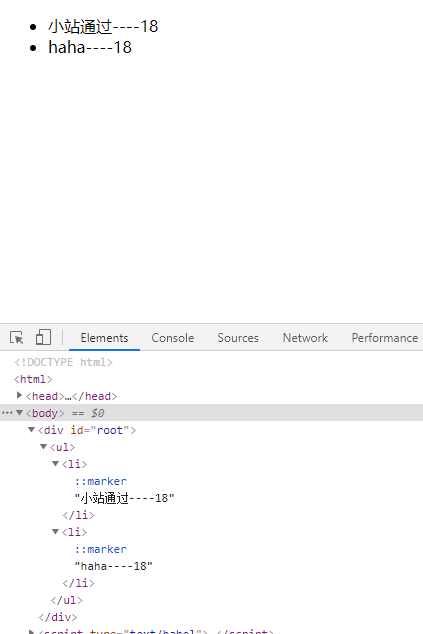

## 1.虚拟DOM

- 本质是Object类型的对象（一般对象）
- 虚拟dom中属性少，真实dom中属性多
- 虚拟dom最终会被React转化为真实DOM,呈现在页面上

## 2.React中的数组

React居然能自动帮你遍历数组！

```jsx
 render(){
  const data =[<li key={1}>小站通过----18</li>,<li key={2}>haha----18</li>]
                return (
                    <ul>
                        {data}
                    </ul>
                )
            }
```

结果：



