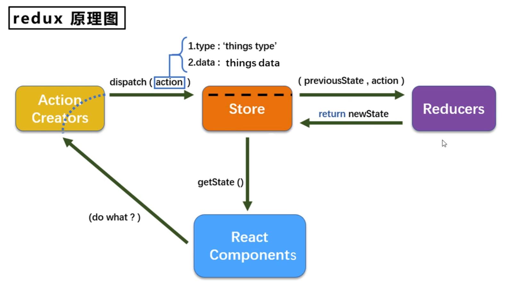
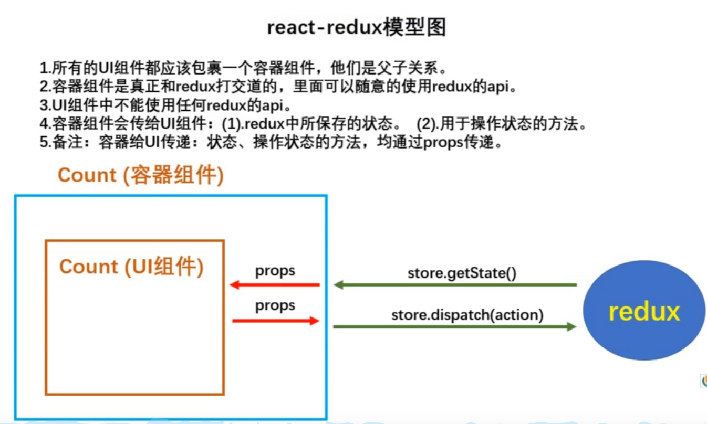
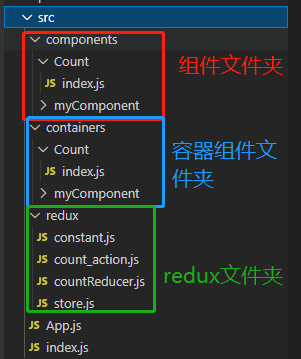
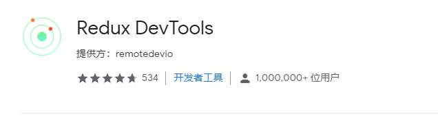

- React Components：你自己的组件
- Action Creators：组件将要做的事情交给Action Creators，Action Creators会翻译你的需求，生成 一个action对象，并使用dispatch（）方法将此对象传给Store。
- action对象：action中包含了两种信息，type：要干啥；data：干的具体信息。如果是初始化，则type就是@@init@@，且没有data。
- Store：Store是总管，接到action后，将以前的State值和当前的action对象一起发给Reducers。如果是初始化，则以前的State值就是undefined。
- Reducers：用来实际进行初始化和计算。接到以前的State值和当前的action对象，进行计算后传回给Store。如果接到的action是初始化，则直接传回初始化的State值。

注：上面所说的action都是指同步action对象，是一个一般Object对象，还有一种异步action，是以函数的形式存在，需要用到thunk中间件来实现。

## 1.redux Demo

### 1.1 精简版

(1).去除Count组件自身的状态
(2).src下建立:
					-redux
						-store.js
						-count_reducer.js

(3).store.js：
				1).引入redux中的createStore函数，创建一个store
				2).createStore调用时要传入一个为其服务的reducer
				3).记得暴露store对象

```js
//使用createStore方法来创建stroe对象
import  { createStore } from "redux"
//createStore方法需要传入reducer对象
import countReducer from './countReducer'
export default createStore(countReducer)
```

(4).count_reducer.js：
				1).reducer的本质是一个函数，接收：preState,action，返回加工后的状态
				2).reducer有两个作用：初始化状态，加工状态
				3).reducer被第一次调用时，是store自动触发的，
								传递的preState是undefined,
								传递的action是:{type:'@@REDUX/INIT_a.2.b.4}
	
(5).在index.js中监测store中状态的改变，一旦发生改变重新渲染`<App/>`,使用的方法是subscribe,每次store中的状态发生改变时，就会调用subscribe方法的回调函数：

```js
//index.js
import reactDom from 'react-dom'
import App from './App'
import store from './redux/store'
reactDom.render(<App/>,document.getElementById("root"))
store.subscribe(() =>
reactDom.render(<App/>,document.getElementById("root")))

```

​		备注：redux只负责管理状态，至于状态的改变驱动着页面的展示，要靠我们自己写。

### 1.2 完整版

新增文件：
		1.count_action.js 专门用于创建action对象

```js
import {INCREASE,DECREASE} from './constant'
export const  createIncreaseAction=data => ({type:INCREASE,data})
export const  createDecreaseAction=data => ({type:DECREASE,data})
```

​		2.constant.js 放置容易写错的type值

```js
export const INCREASE ='increase';
export const DECREASE ='decrease';
```

## 2.react-redux



### 2.1 开发步骤

由原理图得，每次想要使用redux,必须在实际组件外面包裹一个容器组件，看下文件框架：



#### 2.1.1容器组件

先写UI组件，不要暴露

然后写容器组件（containers/Count/index.js）：

```js
//引入connect 方法，用于连接UI组件和redux，需预先下载
import {connect} from 'react-redux'
//引入UI组件
import CountUI from '../../components/Count'

export default connect(mapStateToProps,mapDispatchToProps)(CountUI)
```

connect函数很重要：

1.connect()()：connect()函数返回一个函数，再调用这个函数才返回一个容器组件，所以要连着调用两次。

2.connect(a,b)：connect函数要传入两个函数作为参数:

​		2.1 mapStateToProps(state): react会自动调用这个这个函数，将redux中的state传进来，并将返回值（是个		对象） 以props的形式传给UI组件；也就是原理图中的第一条线了。

​		2.2 mapDispatchToProps(dispatch)：此函数react会自动将dispatch函数作为参数传进来，并将返回值（对		象）作以props的形式传给UI组件，也就是图中的第二条线。由于第二条线是子组件操作父组件数据，所以要		传入对象中都是是函数。

3.connect()(CountUI)：返回的这个函数需要传入一个参数，参数就是该容器组件对应的UI组件。


编写这两个函数，传给connect函数：

```js
function mapStateToProps(state){
    //把redux中的State传给此容器中的UI组件中的props
    return {count:state}
}
//同样将return的对象装在子UI组件的props中
function mapDispatchToProps(dispatch)  {
    return {
        //子组件调用此函数，将action发送给store
        increase:(number) => {
            dispatch(createIncreaseAction(number*1))
        },
        decrease:(number) => {
            dispatch(createDecreaseAction(number*1))
        }
    }
}
```

#### 2.1.2 mapDispatchToProps函数的精简写法

connect(mapStateToProps,mapDispatchToProps)方法，本是传入两个函数，但也可精简写，第二个参数传入一个对象：

```jsx
export default connect(mapStateToProps,{
    increase:createIncreaseAction,
    decrease:createDecreaseAction
})(CountUI)
```

这样写，相当于传入了一个对象，对象中有几个属性，这几个属性都是actionCreator中的函数，返回一个action对象，react-redux如果发现函数返回了一个action对象，就会自动dispatch给store。

#### 2.1.3挂载容器组件

写完容器组件和相对应的UI组件后，就要挂载组件了，以前我们直接挂载UI组件，现在需要挂载容器组件。

```jsx
import { Component } from 'react'
//这个Count组件已经被改为来自于容器组件文件夹了
import Count from './containers/Count'
import store from './redux/store'

export default class App extends Component {
    render() {
        return (
            <div>
                <Count store={store}/>
            </div>
        )
    }
}

```

使用容器组件时，必须将store对象通过参数传进去，这样才能将store和UI组件联系起来。有时我们会挂载很多容器组件，每个都写就很麻烦，这时候可以引入Provider标签，它可以识别其中的所有容器组件，并把store传进去。我们使用Provider包裹App组件就行了。

```jsx
import reactDom from 'react-dom'
import { Provider } from 'react-redux'
import App from './App'
import store from './redux/store'

reactDom.render(
	<Provider store={store}>
    	<App/>
	</Provider>
,document.getElementById("root"))
//有react-redux就不需要手动渲染了。react-redux会再state更新后自动渲染
// store.subscribe(() =>
// reactDom.render(<App/>,document.getElementById("root")))

```

**注意：**可以把UI组件和容器组件写在同一个文件中，别暴露UI组件，只默认暴露容器组件即可。

## 3.redux开发工具

1. 谷歌商店下载插件



2. 使用yarn下载：

```markdown
yarn add redux-devtools-extension
```

3. 在redux的store文件中，使用createStore方法创建store时作为第二个参数传入

```javascript
import {composeWithDevTools} from 'redux-devtools-extension'
				const store = createStore(allReducer,composeWithDevTools())
```


## 4.redux实现多组件state管理

