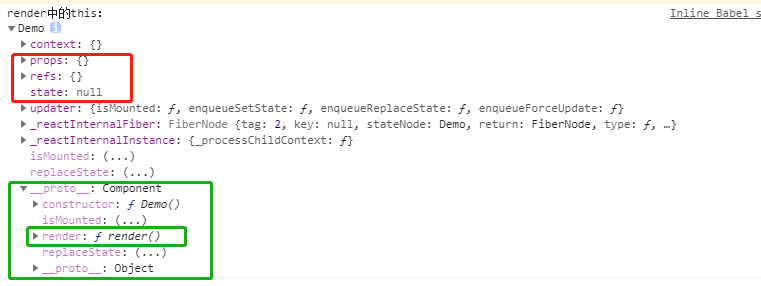

## 1.函数式组件

```html
<div id="root">			</div>
<script type="text/babel"> /*此处一定要写babel*/
		 //1.创建函数式组件(1.首字母必须大写)
		function Demo(){
            return <h1>函数式组件，适用于简单组件的定义</h1>//2.函数必须有返回值
        }
		//2.渲染组件到页面(3.组件名必须加标签，且标签必须自结束)
		ReactDOM.render(<Demo/>,document.getElementById('root'));
</script>
```

在执行了ReactDOM.render(……）之后，发生了什么：

1. React会解析组件标签，找到Demo组件。
2. 发现组件是使用函数定义的，随后调用该函数，将返回的虚拟DOM转为真实DOM,随后呈现在页面中

## 2.类式组件

类式组件必须继承React.Component类，且必须有render方法，react会对render方法的返回值进行渲染

```html
<div id="root">
			
</div>
<script type="text/babel"> /*此处一定要写babel*/
        //1.创建类式组件
		class Demo extends React.Component{
		//构造方法可以没，render方法必须有，且必须有返回值
            render(){
                return <h1>类式组件，适用于复杂组件的定义</h1>
            }
        }
        //渲染组件到真实dom
        ReactDOM.render(<Demo/>,document.getElementById('root'))
</script>
```

在执行了ReactDOM.render(……）之后，发生了什么：

1. React会解析组件标签，找到Demo组件。
2. 发现组件是使用类定义的，随后new出该类的实例，在用该类的实例调用到原型上的的render方法，将返回的虚拟DOM转为真实DOM,随后呈现在页面中

我们来看一下这个react自动为我们创建的实例都有哪些属性？很多文章直接称之为组件实例对象：



绿框是该实例对象的原型对象，可以看到我们自己写的render方法就在其中；

红框中的三个属性是组件的三大属性！


