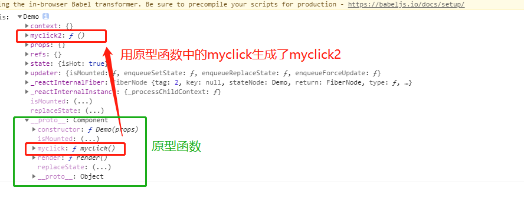

## 组件实例的三大属性：state

前台要使用的数据就需要存放在state中,下面是一个例子：

```javascript
class Demo extends React.Component{
            constructor(props){
                super(props);
                //需要在构造函数中赋值
                this.state ={date:12,isHot:true,}
            }
            render(){
                //注意，函数中要使用对象的属性时必须用this，而date和isHot都在demo组件对象的state对象中，所以要使用this.state.date去调用
                return <h1  >今天是{this.state.date}号，天气很{this.state.isHot ? '炎热':'凉爽'}</h1>
            } 
        }
```

### state中的this

```jsx
//1.创建类式组件
		class Demo extends React.Component{
            constructor(props){
                super(props);
                this.state ={isHot:true}
             //   this.myclick = this.myclick.bind(this);
            }
            render(){
                console.log('render中的this：',this);
                
                return <h1  onClick={this.myclick} >今天天气很{this.state.isHot ? '炎热':'凉爽'}</h1>
            }
            myclick(){
                console.log(this);    
            }
        }
        //渲染组件到真实dom
        ReactDOM.render(<Demo/>,document.getElementById('root'))
```

当你点击h1标签的时候，会调用myclick()，但是这时候已经是window在调用myclick()了，所以console.log出来的this就是undefined;

但是，如果我们加了一句 `this.myclick = this.myclick.bind(this);`情况就不一样了：

bind方法可以将这个函数的this改变，并且返回一个新的已经变过this的函数；

```javascript
class Demo extends React.Component{
            constructor(props){
                super(props);
                this.state ={isHot:true}
                //构造函数中的this就是组件实例对象，myclick()函数实际定义在组件实例对象的原型对象上
                //this.myclick.bind(this)的意思就是将this对象的原型对象上的myclick函数拿过来，将它的this绑定为这个组件实例对象本身，然后生成新函数返回
                //组件实例对象此时声明了一个新变量myclick2，用来接新生成的函数，且这个函数的this已经被绑定好了
                this.myclick2 = this.myclick.bind(this);
            }
            render(){
                console.log('render中的this：',this);
                //把构造函数中声明的myclick2赋值给onClick，这时候你再使用window调用myclick2，里面的this已经被绑定为Demo组件的实例对象啦 
                return <h1  onClick={this.myclick2} >今天天气很{this.state.isHot ? '炎热':'凉爽'}</h1>
            }
    
            myclick(){
                console.log(this);    
            }
        }
        //渲染组件到真实dom
        ReactDOM.render(<Demo/>,document.getElementById('root'));
```

经过这一句的操作，相当于把本来在Demo实例对象的原型对象上的myclick方法复制了一遍，放在了Demo实例对象上，叫myclick2,且this已经被绑定为Demo实例对象。



### setState()

要实现点一下，天气从凉爽变成炎热：

```jsx

		class Demo extends React.Component{
            //只调用一次：页面初始化的时候
            constructor(props){
                super(props);
                this.state ={isHot:true}
                this.myclick2 = this.myclick.bind(this);
            }
            //调用1+n次：1是初始化的时候，n是state更新的时候
            render(){
                console.log('render中的this：',this);
                
                return <h1  onClick={this.myclick2} >今天天气很{this.state.isHot ? '炎热':'凉爽'}</h1>
            }
            //点击几次调用几次
            myclick(){
                const {isHot}=this.state
                //状态必须通过setState方法进行更新，传入对象，且更新是一种合并，并不是替换。
                this.setState({isHot:!isHot});  
            }
        }
        //渲染组件到真实dom
        ReactDOM.render(<Demo/>,document.getElementById('root'))
		
```

