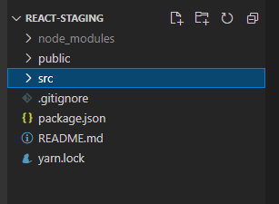

## 1.使用create-react-app创建工程

1. 安装脚手架,需要全局安装：`npm i -g create-react-app`
2. 进入到想要创建工程的文件夹，cmd执行`create-react-app hello-react`
3. 进入到新建的工程目录：`cd hello-react`
4. `yarn start`来启动工程！（其实就是借助于webpack-dev-server来启动的，所以能热部署）

## 2.工程介绍



刚创建的项目就两个文件夹，src和public,打开它：

public：静态资源文件夹（服务器访问的根路径，假如你访问localhost:8080/index.html，那就会找到public文件夹下的index.html）

src：源码文件夹


src：

App.js：	是一个叫app的函数组件，App.css是其样式。

index.js：	就是webpack入口文件，引入了一些必要的模块，还有App组件，并使用ReactDOM.render将App组件放入root根节点。

```jsx
ReactDOM.render(
  <React.StrictMode>
    <App />
  </React.StrictMode>,
  document.getElementById('root')
);
```


public：

index.html：	是模板html，模板中有一个id为root的div，用来作为根节点放入组件

根据之前学的webpack内容，webpack会使用`HtmlWebpackPlugin`插件，将public/index.html作为模板文件进行编译，在编译中将**入口文件的编译后的文件**，使用**style的方式**引进到**模板文件**，再输出为**新的文件**。

## 3.开发原则

1.动态初始化列表，如何确定将数据放在哪个组件中？

- 某个组件使用：放在自身的state中
- 某些组件使用：放在他们共同的父组件的state中

2.关于父子之间的通信：

- 父组件给子组件传递数据：通过props传递

- 子组件给父组件传递数据：通过props传递，要求父组件提前给子组件传递一个函数，由子组件调用。

3.状态在哪里，操作状态的方法就在哪里。