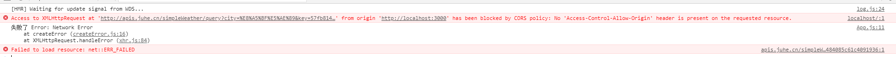

## 1.ajax

写一个简单组件来获取天气信息：

```jsx
import {Component} from "react";
import axios from 'axios'

export default class App extends Component {
    //按钮回调
    getWeatherData=()=>{
        //axios.get返回一个promise对象
        const promise =axios.get("http://apis.juhe.cn/simpleWeather/query?city=%E8%A5%BF%E5%AE%89&key=57fb8149f1ea6fa484085c61c4091936")
        //promise.then设置回调函数
        promise.then(response=>{
            console.log('成功了');
            console.log(response.data);
   
        },error=>console.log('失败了',error)
        );
    }
    
    render(){
        return (
            <div onClick={this.getWeatherData}> <button>点我获取天气信息</button></div>
           
        )
    }
}
```

出现以下报错：



是因为跨域了，ajax设置了同源策略，在传统项目中，前端后台在一个服务器一个端口上，所以要求ajax必须发给自己所在的端口，不然就只能发过去这个异步请求，但不让你回来。为了解决这个问题，就需要代理了。

## 2.代理

代理的原理就是在应用所在的服务器端口上开了一个微小的服务，你的异步请求直接去请求这个服务，这时候就不算跨域，然后再由这个服务去转发请求，给别的服务器，等数据回来后再给你的应用。

### 2.1代理配置方法一

在npm配置文件：package.json中，加入

```json
"proxy":"http://apis.juhe.cn"
```

这样写，那么你这个应用的所有请求，会先在本服务器中找，找到之后就不会找代理，如果没找到，就会发给代理服务器。

所以你请求的时候，就可以这样写：

```jsx
const promise =axios.get("http://localhost:3000/simpleWeather/query?city=%E8%A5%BF%E5%AE%89&key=57fb8149f1ea6fa484085c61c4091936")
```

这样，应用会在本地服务器中（localhost:3000）找这个地址（simpleWeather/query），没找到就去找代理，吧http://localhost:3000替换为http://apis.juhe.cn

缺点：只能配置一个，但通常需要多个代理

### 2.2代理配置方法二

在src目录中创建一个`setupProxy.js`文件，名字不能变，react会读取这个文件的。

