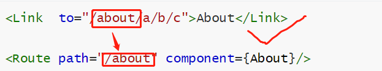

路由是靠着浏览器的History实现的。

1. 下载`react-router-dom`
2. 引入并使用

## 1.BrowserRouter

**路由的各种标签要在路由器中使用**，也就是Router中，有两种路由器供使用，BrowserRouter和HashRouter，一般选BrowserRouter；且一组link和route要想起作用，就要在同一个路由中，所以干脆**在入口文件中，使用BrowserRouter标签将app包住**，后面在代码中就随便用了。

```jsx
ReactDOM.render(
    <BrowserRouter>
        <App/>
    </BrowserRouter>,
document.getElementById("root"))
```

## 2.link&NavLink

```jsx
<Link  to="/about">About</Link>
<NavLink activeClassName="choosed" to="/about">About</Link>
```

显示出来像a标签，点击的话就会把地址改为to属性中的内容

NavLink是Link的升级版，会在点击后将activeClassName属性的值追加在className属性中，这样就可以做一些点击后样式改变的功能。

## 3.Route

```jsx
<Route path="/about" component={About}/>
```

监测到浏览器路径变为path中的内容后，就将component中的组件渲染到页面上，当然，路径在改变成别的的话就会卸载这个组件。

## 4.路由组件和一般组件的区别

​		1.写法不同：
​					一般组件：<Demo/>
​					路由组件：<Route path="/demo" component={Demo}/>
​		2.存放位置不同：
​					一般组件：components
​					路由组件：pages
​		3.接收到的props不同：
​					一般组件：写组件标签时传递了什么，就能收到什么
​					路由组件：接收到三个固定的属性
​										history:
​													go: ƒ go(n)
​													goBack: ƒ goBack()
​													goForward: ƒ goForward()
​													push: ƒ push(path, state)
​													replace: ƒ replace(path, state)
​										location:
​													pathname: "/about"
​													search: ""
​													state: undefined
​										match:
​													params: {}
​													path: "/about"
​													url: "/about"

## 5.Switch

假如你写了一个link，是/test，但是写了多个Route都对应test，那么react会遍历一遍所有的路由，把所有能对应上的组件渲染出来，用`<Switch></Switch>`包住以后，就会在找到第一个对应的路由时停下，并渲染出来，这样能提升页面的性能。

## 6.模糊匹配与严格匹配

```jsx
<Link  to="/about/a/b/c">About</Link>
<Route path="/about" component={About}/>
//能匹配上
<Link  to="/about">About</Link>
<Route path="/about/a/b/c" component={About}/>
//匹配不上
<Link  to="/a/about/b/c">About</Link>
<Route path="/about" component={About}/>
//匹配不上
```

说明默认情况下是模糊匹配；

匹配规则如下：



link拿一个，和about的第一个去比，一样的话就比下一个，直到比到路由的path比完，全一样就匹配成功！

要想开启严格匹配，需要加exact。默认不加为false。

```jsx
//以下两种效果一样
<Route exact={true} path="/about" component={About}/>
<Route exact path="/about" component={About}/>
```

## 7.Redirect

假如这个路由器全部没匹配上，就听Redirect的，

```jsx
//以下两种效果一样
<Route  path="/about" component={About}/>
<Route  path="/home" component={Home}/>
<Redirect to="/about"/>
```

## 8.二级路由

1.注册子路由的时候要写上父路由的path值

2.路由的匹配是按照注册路由的顺序进行的。

## 9.向路由器传递参数

### 9.1. params参数

​						路由链接(携带参数)：`<Link to='/demo/test/tom/18'}>详情</Link>`
​						注册路由(声明接收)：`<Route path="/demo/test/:name/:age" component={Test}/>`
​						接收参数：this.props.match.params

### 9.2. search参数

​						路由链接(携带参数)：`<Link to='/demo/test?name=tom&age=18'}>详情</Link>`
​						注册路由(无需声明，正常注册即可)：`<Route path="/demo/test" component={Test}/>`
​						接收参数：this.props.location.search
​						备注：获取到的search是urlencoded编码字符串，需要借助querystring解析,引入querystring（react脚手架已经下载好，直接引入即可）：`import qs from 'querystring'`，然后使用即可

#### 	querystring的使用

```js
let  str="name=小张&age=16";
let person = qs.perse(str);//{name:"小张",age:"16"}
```

```js
let person={name:"小张",age:"16"}
let str=qs.stringify(person);//"name=小张&age=16"
```

所以，要处理url上这种`?name=tom&age=18`，就要使用qs的perse方法，当然，要处理掉`?`:

```js
let person = qs.perse(this.props.location.search.slice(1));//{name:"Tom",age:"18"}
```


### 9.3. state参数

​						**Link的to属性直接接个对象，这个对象要有pathname和state属性。**

​						路由链接(携带参数)：`<Link to={{pathname:'/demo/test',state:{name:'tom',age:18}}}>详情</Link>`
​						注册路由(无需声明，正常注册即可)：`<Route path="/demo/test" component={Test}/>`
​						接收参数：this.props.location.state
​						备注：刷新也可以保留住参数

## 10.push与replace

浏览器history其实是个栈结构，前进就是将新的地址压入栈，点后退就是出栈。

push: 默认情况下路由就是push模式，将当前地址压入栈

replace: 替换模式，就是将当前栈顶的地址替换为新的地址，想要实现就再Link上加replace

```jsx
<Link replace to="/about/a/b/c">About</Link>
```

## 11.编程式路由导航

很多时候并不能使用Link，然后手动点击去跳转路由，而是要代码自动跳转，这时候就不能用Link了，只能自己编程去跳转了：

其实也很简单：

有两个按钮，一按就跳转到别的路由，一个是以push方式跳转，一个是以replace方式跳转：

```jsx
<button onClick={()=>this.pushShow(id,title)}>path</button>
<button onClick={()=>this.replaceShow(id,title)}>replace</button>   
```

```js
//事件响应函数
pushShow=(id,title)=>{
      this.props.history.push(`/home/message/detil/${id}/${title}`)
    }

replaceShow=(id,title)=>{
      this.props.history.replace(`/home/message/detil/${id}/${title}`)
    }
```

也就是说，调用history中的replace和push方法就能操作跳转了

如果想用search参数形式，那就改改就行了

```jsx
pushShow=(id,title)=>{
      this.props.history.push(`/home/message/detil?id=${id}&title=${title}`)
    }
```

还有state参数：

```jsx
pushShow=(id,title)=>{
      this.props.history.push(`/home/message/detil`,{id,title})
    }
```

现在来看看history中的这些方法：

```markdown
history:
​	go: ƒ go(n)
​	goBack: ƒ goBack()
​	goForward: ƒ goForward()
​	push: ƒ push(path, state)
​	replace: ƒ replace(path, state)
```

push和replace上面演示过了，都接收两个参数，但只有第三种形式才会用到第二个参数state；

goback和goForward就是浏览器上方的前进和后退；go接收一个number，是正数就向前正数数值的步数，反之就是后退。

