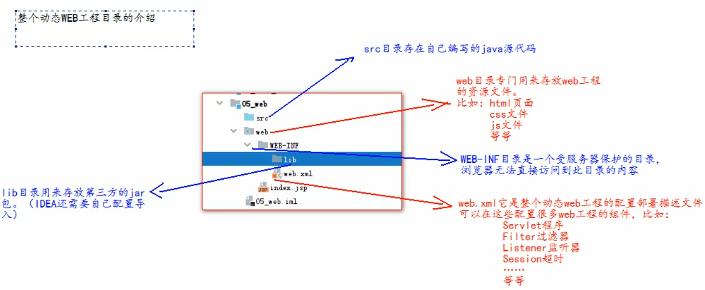
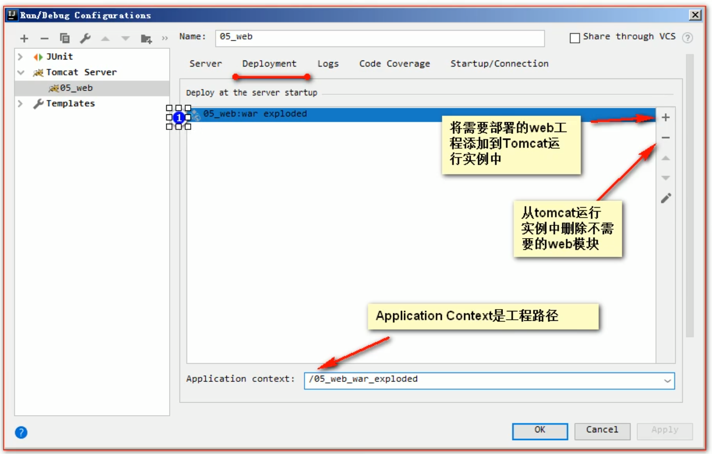

## 1.修改端口

1. conf文件夹中的server.xml文件。
2. 打开找得到&lt;Connector&gt;标签，修改它的port属性。
3. 端口号用1-65535都可以，一般建议1000以上
4. 修改完必须重启tomcat 才会生效。

## 2.默认访问

地址组成：

ip地址:端口号/工程名称/访问资源

### 2.1默认端口

http默认端口就是80端口，只要地址栏看不到，就是80端口。

localhost:80 = localhost

http:www.baidu.com = http:www.baidu.com:80

### 2.2.默认工程

默认工程就是ROOT工程

http://127.0.0.1:8080/ = http://127.0.0.1:8080/ROOT

### 2.2.默认访问页面

默认访问页面就是index.html

http://127.0.0.1:8080/ = http://127.0.0.1:8080/ROOT/index.html

## 3.web工程目录

## 4.在idea环境中把工程加到tomcat中

