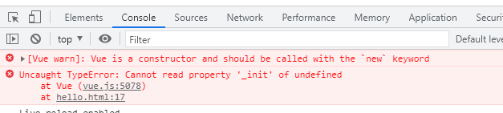

### 注意点

#### - Vue实例和容器之间是11对应的关系。

#### - 容器中的双大括号中间只能写js表达式，而不能写js代码

**js表达式**：一个表达式可以产生一个值，可以放在任何一个需要值的地方（用一个变量去接），例如

​	（1）a

​	（2）

​	（3）

​	（4）

**js代码（语句）**：

​	（1）if(){}

​	（2）for(){}

#### - Vue的本质其实是一个构造函数！

假如你在声明Vue实例时忘了写new，就像普通函数那样掉用，就会发现报错：

```html
<script type="text/javascript">
          Vue({
                el:'#root',
                data:{
                    name:'什么'
                }
            })
        </script>
```




我们查看一下源码，发现它是这样来判断的：

```js
  function Vue (options) {
    if (!(this instanceof Vue)
    ) {
      warn('Vue is a constructor and should be called with the `new` keyword');
    }
    this._init(options);
  }
```

很简单，它直接判断了一下this，如果this是通过Vue new出来的实例，则没问题；如果不是，就报错！

接下来解释这段代码：

​	首先明确，当你正常调用一个函数时，谁调用的这个函数，这个函数中的this就是谁。

例如上面的例子，如果没写new，就相当于是正常调用，那么Vue中的this就是window对象。这样的话当然就会报错。

如果是通过new来创建实例，会发生什么呢？

[见JS笔记的6.2-6.3](../../JS.md)

通过之前的笔记能了解到new一个对象时会发生什么，接下来我们只要看看instanceof会发生什么就行了：

1、instanceof实现原理

```js
function instance_of(L, R) {//L 表示左表达式，R 表示右表达式 
    var O = R.prototype;   // 取 R 的显示原型 
    L = L.__proto__;  // 取 L 的隐式原型
    while (true) {    
        if (L === null)      
             return false;   
        if (O === L)  // 当 O 显式原型 严格等于  L隐式原型 时，返回true
             return true;   
        L = L.__proto__;  
    }
}
```

2、说明

示例： a instanceof B

检测a的原型链（`__proto__`）上是否有B.prototype，若有返回true，否则false。


当我们了解了new的原理和instanceof原理后，就能理解了。

