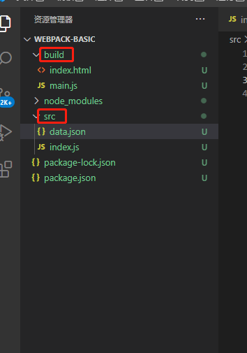

## 1.安装

1.新建工程：webpack-basic

2.进入工程：`npm init -y`

3.使用npm安装：

`npm i webpack webpack-cli`

4.搭文件框架：



src文件夹：用来放自己写的代码

src/index.js：webpack入口起点文件


build文件夹：用来放打包后的文件（页面真正要引入的文件）

build/main.js：入口文件转换后的文件

build/index.html：真实页面


5.执行打包语句：

```markdown
webpack .\src\index.js -o .\build\main.js --mode=development
        
```

翻译：webpack会以.\src\index.js为入口文件开始打包，打包后输出到.\build\main.js，整体打包环境是开发环境,如果是开发环境，就是--mode=production

6.webpack.config.js

webpack 的配置文件，有这个文件的话，直接在终端使用 webpack指令就能编译了

如果要使用开发环境热部署，就需要下载并配置webpack-dev-server，然后使用`npx webpack serve`指令来启动它。

# 2.特性介绍

1. webpack 能处理js/json资源，不能处理css/img等其它资源
2. 生产环境和开发环境将ES6模块化编译成浏览器能识别的模块化
3. 生产环境比开发环境多一个压缩js代码的功能。

