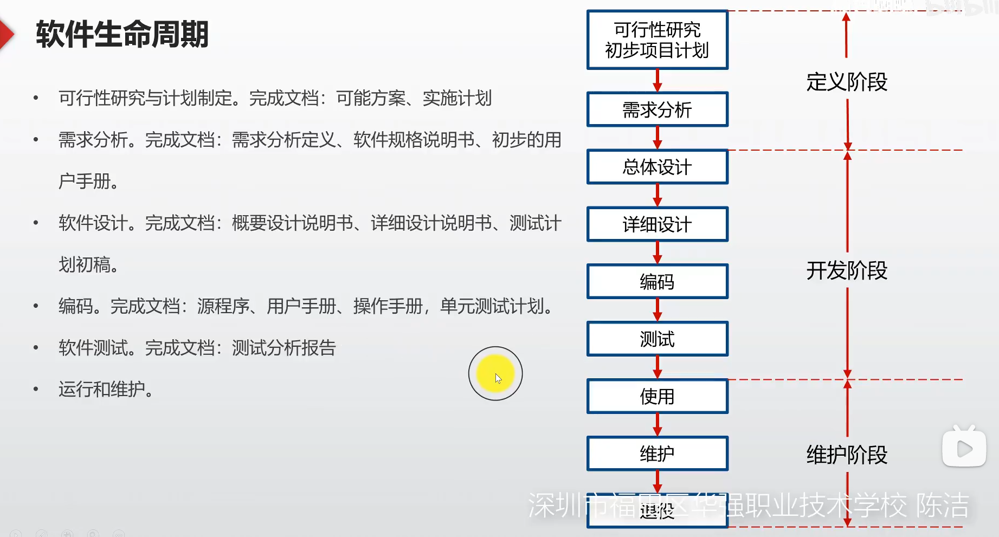
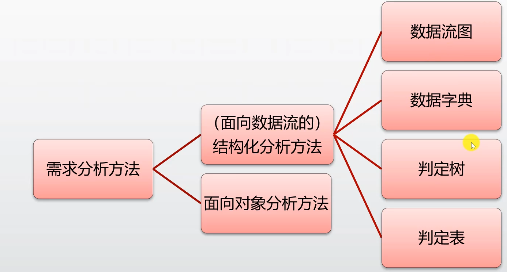
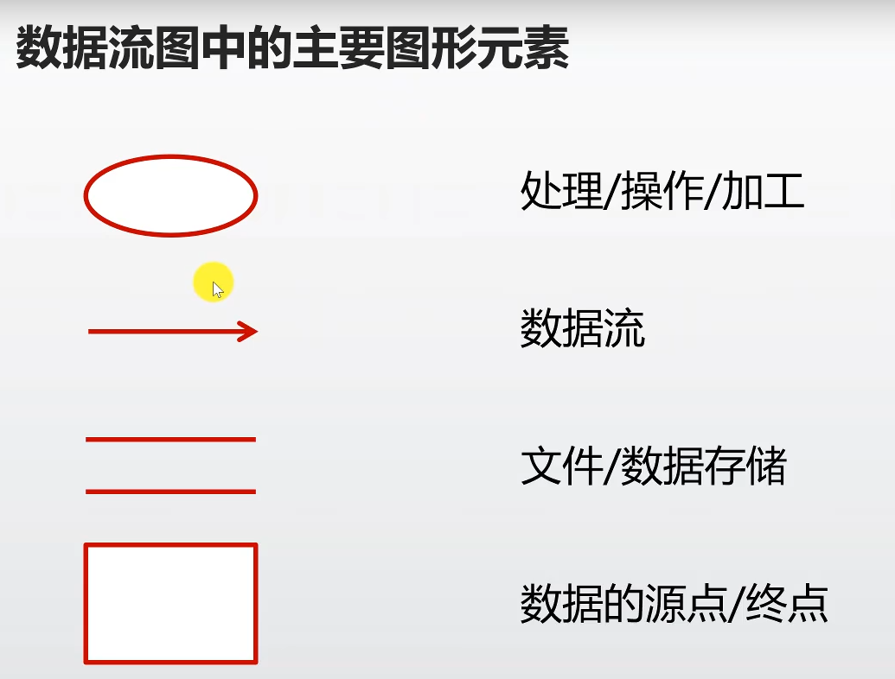
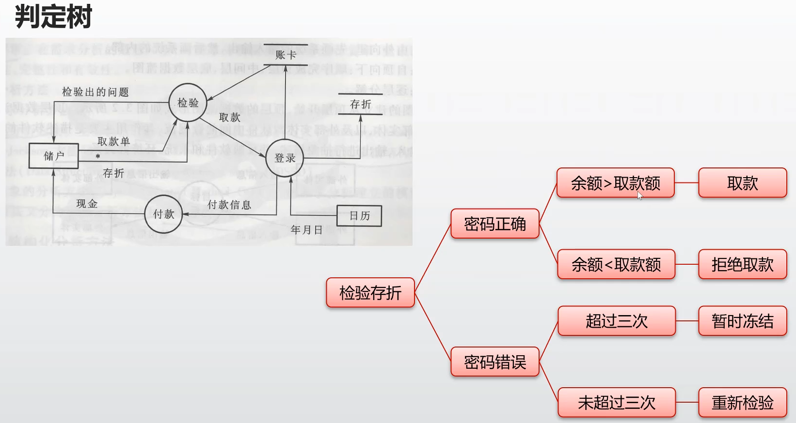
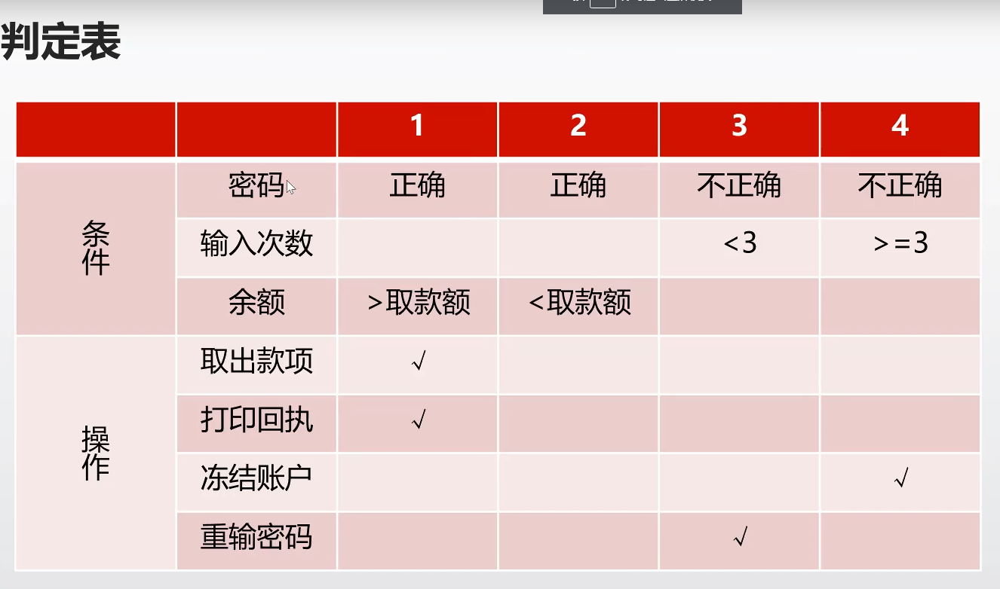

## 软件生命周期

## 需求分析

### 1.需求分析将创建：

数据模型、功能模型、控制模型

### 2.本阶段的工作：

- 需求获取
- 需求分析（最终给出系统的解决方案和目标系统的模型）
- 编写需求规格说明书
- 需求评审

### 3.需求分析方法

一般分为结构化分析法和面向对象分析法。常用结构化分析法

#### 3.1结构化分析法

着眼于数据流，自顶向下，逐层分解，建立系统的处理流程，以数据流图和数据字典为主要工具，建立系统的逻辑模型。

##### 3.1.1 数据流图（DFD）

- 数据存储之间不应有数据流
- 不会出现只有输出没有输入的情况

##### 3.1.2 数据字典（DD)

数据字典的作用就是对DFD中出现的被命名的图形元素的确切解释

例如：
部门="001".."006"
日期=年+月+日
年="1970".."9999"
月="01".."12"
日="01".."31"

##### 3.1.3 判定树和判定表

针对数据流图中的操作给出

任选其一皆可，看个人习惯。