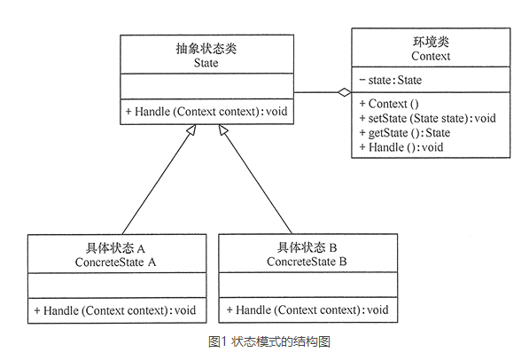

**教程地址：http://c.biancheng.net/view/1388.html**

## 使用场景

适用于一堆if else或者switch,一个对象根据状态会有不同行为的时候使用。

注意：只能在行为不会扩展，而状态会扩展的场景使用。

## 

Client：正儿八经对象，比如说People对象，根据状态不同，做出同一件事情的行为也不一样，高兴时，walk就是蹦着走，不高兴时，walk就是垂头丧气走。需要聚合State或者组合State的实现类。

State：抽象类或接口，把所有行为声明一下

State实现类：每个状态一个实现类，把自己的行为实现一下。如果不牵扯状态之间的变更，就不用聚合Client，如果牵扯，就需要聚合Client对象。


接下来就说下这两种情况：

- 状态之间不变更：

  很简单。People类，有Happy和Sad状态，都有work方法

  ```java
  public class People(){
      public State state;//聚合State
      public void work(){
          state.work;
      };
      public State getstate(){
          //略
      };
      public void setstate(State state){
          //略
      };
  }
  ```

  ```java
  public interface State(){
      void work();
  }
  ```

  ```java
  public class happy implements State(){
      void work(){
          sout('高兴的上班');
      };
  }
  ```

  ```java
  public class sad implements State(){
      void work(){
          sout('难过的上班');
      };
  }
  ```

  使用的话，先new个State实现类，再new个People，把state给people set进去就行了，然后People.work()

- 状态之间变更：

  这种的话相对复杂，就是State实现类也要组合或聚合People类，因为要在State实现类进行状态的切换

  ```java
  package state;
  public class StatePatternClient
  {
      public static void main(String[] args)
      {       
          Context context=new Context();    //创建环境       
          context.Handle();    //处理请求
          context.Handle();
          context.Handle();
          context.Handle();
      }
  }
  //环境类
  class Context
  {
      private State state;
      //定义环境类的初始状态
      public Context()
      {
          this.state=new ConcreteStateA();
      }
      //设置新状态
      public void setState(State state)
      {
          this.state=state;
      }
      //读取状态
      public State getState()
      {
          return(state);
      }
      //对请求做处理
      public void Handle()
      {
          state.Handle(this);
      }
  }
  //抽象状态类
  abstract class State
  {
      public abstract void Handle(Context context);
  }
  //具体状态A类
  class ConcreteStateA extends State
  {
      public void Handle(Context context)
      {
          System.out.println("当前状态是 A.");
          context.setState(new ConcreteStateB());
      }
  }
  //具体状态B类
  class ConcreteStateB extends State
  {
      public void Handle(Context context)
      {
          System.out.println("当前状态是 B.");
          context.setState(new ConcreteStateA());
      }
  }
  ```

  上面的方法就是标准解决方法，只是它没有选择把State实现类组合进Context,而是在State实现类中，在具体方法里去new新State并set进Context中，这种方法更符合开闭原则。

  

  第二种方法，就可以把State直接组合进Context，然后写一堆get和set方法来获取State实现类对象，如下：

  ```java
  //环境类
  class Context
  {
      private State state;
      //定义环境类的初始状态
      private State stateA=new ConcreteStateA();//直接组合进去
      private State stateB=new ConcreteStateB();
      
      public Context()
      {
          this.state=new ConcreteStateA();
      }
      
      //一堆get和一个set
      public State getStateA()
      {
          return(stateA);
      }
     
       public State getStateB()
      {
          return(stateB);
      }
        public void setState(State state)
      {
          this.state=state;
      }
      
      //对请求做处理
      public void Handle()
      {
          state.Handle(this);
      }
  }
  ```

  ```java
  //具体状态A类
  class ConcreteStateA extends State
  {
      public void Handle(Context context)
      {
          System.out.println("当前状态是 A.");
          context.setState(context.getStateA);
      }
  }
  //具体状态B类
  class ConcreteStateB extends State
  {
      public void Handle(Context context)
      {
          System.out.println("当前状态是 B.");
          context.setState(context.getStateB);
      }
  }
  ```

  这是尚硅谷的例子，个人觉得不如第一个好，这如果要新加状态我还要修改Context类，给他组合新的状态。

  

  

